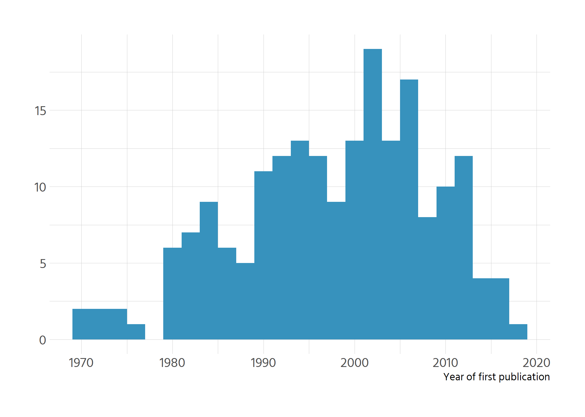
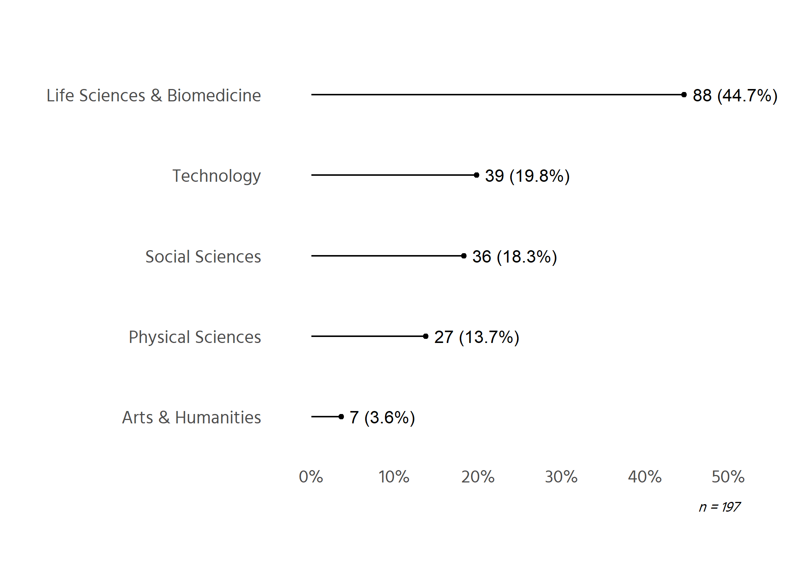
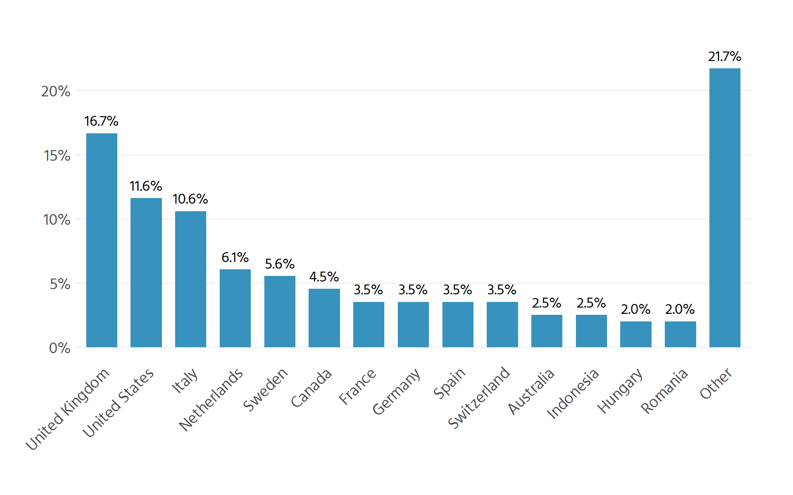
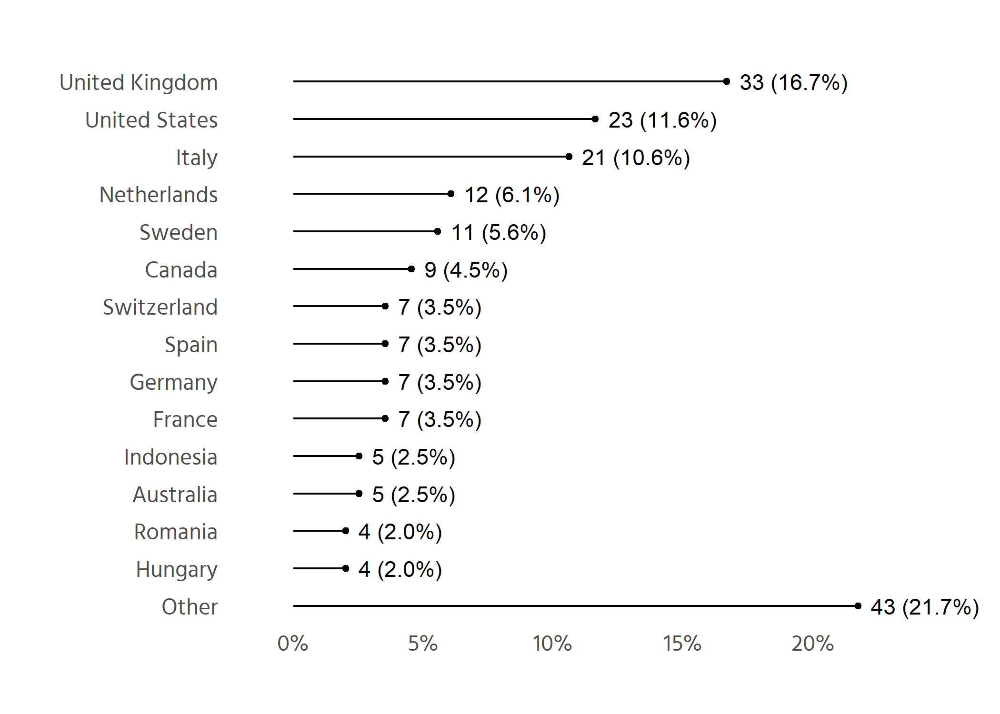
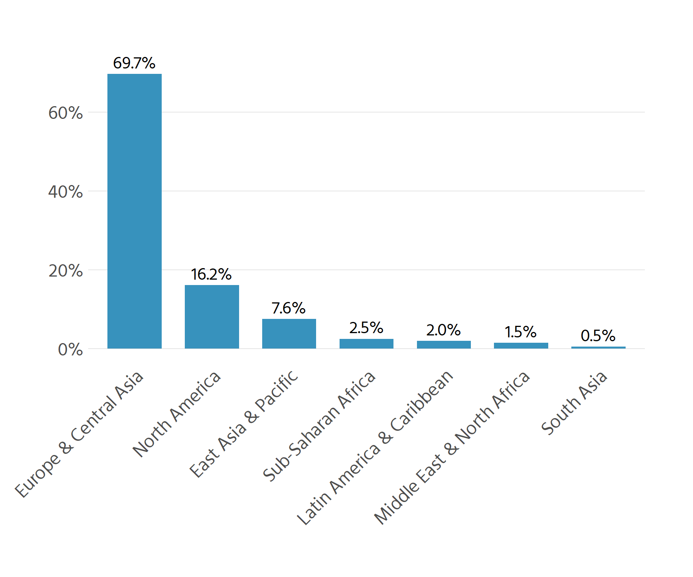
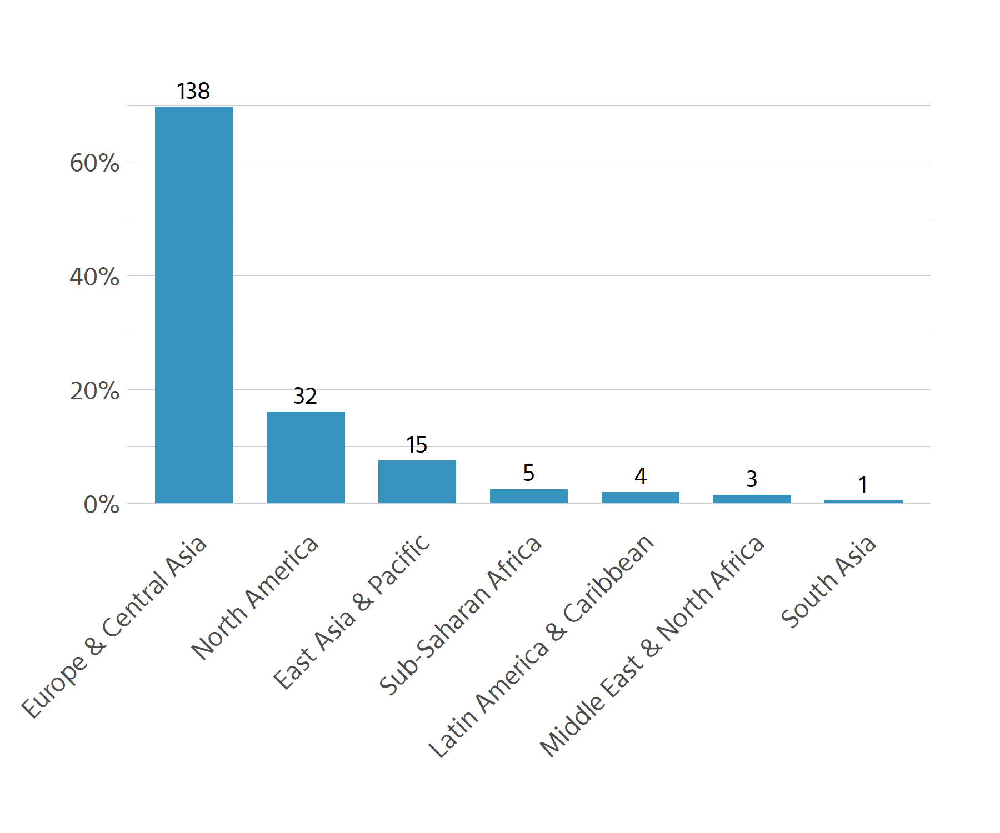
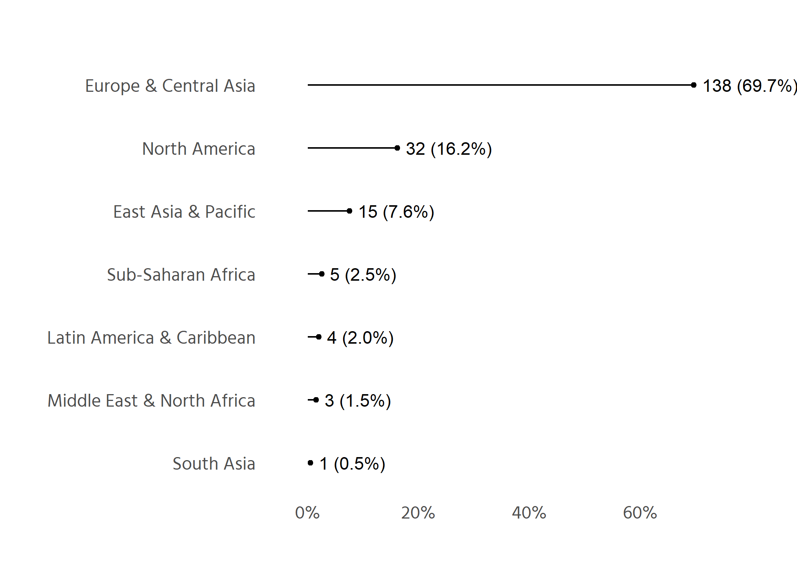

# Gender (X84)


```r
df %>% make_table(X84, label = "Gender")
```


|Gender            |   n|percent |
|:-----------------|---:|:-------|
|Male              | 140|70.7%   |
|Female            |  56|28.3%   |
|Prefer not to say |   2|1.0%    |
|Total             | 198|100.0%  |
# Academic role (X85)

```r
make_table(df, X85, label = "Academic role")
```


|Academic role                                              |   n|percent |
|:----------------------------------------------------------|---:|:-------|
|Professor                                                  |  82|41.4%   |
|Senior Lecturer / Associate Professor  / Senior Researcher |  72|36.4%   |
|Lecturer / Assistant Professor / Research Fellow           |  29|14.6%   |
|Post-doctoral researcher (up to 5 years post-PhD)          |   7|3.5%    |
|Doctoral researcher                                        |   5|2.5%    |
|Other                                                      |   3|1.5%    |
|Total                                                      | 198|100.0%  |

Merge junior roles


```r
df %>% 
  mutate(X85 = case_when(str_detect(X85, "Post-doc") ~ "Prae/Post-doc",
                         str_detect(X85, "Doctoral") ~ "Prae/Post-doc",
                         TRUE ~ X85)) %>% 
  make_table(X85, label = "Academic role")
```


|Academic role                                              |   n|percent |
|:----------------------------------------------------------|---:|:-------|
|Professor                                                  |  82|41.4%   |
|Senior Lecturer / Associate Professor  / Senior Researcher |  72|36.4%   |
|Lecturer / Assistant Professor / Research Fellow           |  29|14.6%   |
|Prae/Post-doc                                              |  12|6.1%    |
|Other                                                      |   3|1.5%    |
|Total                                                      | 198|100.0%  |

# Year of first academic publication (X87)

```r
df %>% 
  # fix mis-typed input
  mutate(X87 = case_when(X87 == 19999 ~ 1999,
                         X87 == 84 ~ 1984,
                         TRUE ~ X87)) %>% 
  ggplot(aes(X87)) +
  geom_histogram(binwidth = 2, fill = custom_blue) +
  labs(x = "Year of first publication", y = NULL)
```

<!-- -->

# Type of instiution (X88 + X89)
Q: "How would you characterise your institution?"

```r
df %>% 
  make_table(X88)
```


|X88                                  |   n|percent |
|:------------------------------------|---:|:-------|
|Both research and teaching intensive | 117|59.1%   |
|Research intensive                   |  48|24.2%   |
|Teaching intensive                   |  23|11.6%   |
|Other                                |  10|5.1%    |
|Total                                | 198|100.0%  |

Q: "How would you characterise your institution?"


```r
df %>% 
  count(X89) %>% 
  drop_na() %>% 
  knitr::kable()
```


|X89                                                      |  n|
|:--------------------------------------------------------|--:|
|clinical hospital                                        |  1|
|intensive research, teaching and patient care activities |  1|
|Medical Outfit                                           |  1|
|Nothing Just  it is a political                          |  1|
|Patient-care                                             |  1|
|Plundered and dying                                      |  1|
|R&D                                                      |  1|
|Research and graduate student supervision                |  1|
|research and monitoring oriented; limited teaching       |  1|
|teaching intensive with a growing emphasis on research   |  1|
# Disciplines (X90 + X91)

```r
df %>% 
  make_table(X90)
```


|X90                   |   n|percent |
|:---------------------|---:|:-------|
|Health                |  21|10.6%   |
|Computer Science      |  19|9.6%    |
|Biology               |  16|8.1%    |
|Engineering           |  15|7.6%    |
|Medicine              |  15|7.6%    |
|Environmental Science |  14|7.1%    |
|Life Sciences         |  12|6.1%    |
|Other                 |  12|6.1%    |
|Physics               |  10|5.1%    |
|Economics             |   8|4.0%    |
|Education             |   8|4.0%    |
|Agriculture           |   5|2.5%    |
|Chemistry             |   5|2.5%    |
|Psychology            |   5|2.5%    |
|Business              |   4|2.0%    |
|Materials Science     |   4|2.0%    |
|Astronomy             |   3|1.5%    |
|Climate               |   3|1.5%    |
|Linguistics           |   3|1.5%    |
|Mathematics           |   3|1.5%    |
|Archeology            |   2|1.0%    |
|History               |   2|1.0%    |
|Philosophy            |   2|1.0%    |
|Sociology             |   2|1.0%    |
|Statistics            |   2|1.0%    |
|Geography             |   1|0.5%    |
|Geology               |   1|0.5%    |
|Public Health         |   1|0.5%    |
|Total                 | 198|100.0%  |


```r
df %>% 
  count(X91) %>% 
  drop_na() %>% 
  knitr::kable()
```


|X91                                                   |  n|
|:-----------------------------------------------------|--:|
|Agroforestry                                          |  1|
|Demography                                            |  1|
|digital humanities                                    |  1|
|Ethics                                                |  1|
|Film Studies                                          |  1|
|Health sciences which is very different from medicine |  1|
|Management information systems                        |  1|
|Neuroscience                                          |  1|
|Science studies                                       |  1|
|Sport                                                 |  1|
|transportation systems                                |  1|


Disciplines were manually grouped by using the topics from the Web of Science:
https://images.webofknowledge.com/images/help/WOS/hp_research_areas_easca.html


```r
df %>% 
  drop_na(disciplines_recoded_wos) %>% # there is one missing case
  make_table(disciplines_recoded_wos)
```


|disciplines_recoded_wos     |   n|percent |
|:---------------------------|---:|:-------|
|Life Sciences & Biomedicine |  88|44.7%   |
|Technology                  |  39|19.8%   |
|Social Sciences             |  36|18.3%   |
|Physical Sciences           |  27|13.7%   |
|Arts & Humanities           |   7|3.6%    |
|Total                       | 197|100.0%  |


```r
plot_bar(df, disciplines_recoded_wos, nudge_y = .01) +
  labs(caption = "n = 197")
```

```
## Registered S3 methods overwritten by 'ggalt':
##   method                  from   
##   grid.draw.absoluteGrob  ggplot2
##   grobHeight.absoluteGrob ggplot2
##   grobWidth.absoluteGrob  ggplot2
##   grobX.absoluteGrob      ggplot2
##   grobY.absoluteGrob      ggplot2
```

<!-- -->

# Type of contract

```r
# X15 = Are you on a limited-term contract?
df %>% make_table(X15)
```


|X15          |   n|percent |
|:------------|---:|:-------|
|No           | 158|79.8%   |
|Yes          |  35|17.7%   |
|Other        |   4|2.0%    |
|I don't know |   1|0.5%    |
|Total        | 198|100.0%  |

```r
df %>% 
  filter(X15 == "Other") %>% 
  select(X16)
```

```
## # A tibble: 4 × 1
##   X16                                                                           
##   <chr>                                                                         
## 1 non-contracted grant researcher                                               
## 2 I am a Complex General Surgical Oncology Fellow and have a postdoctoral resea…
## 3 I retire 4 yrs ago. my fdbk may be irrelevant, but based on my experience aft…
## 4 Definition of my contract is 'permanent' but this subject to the external fun…
```

```r
# one of the "others" is technically on a permanent contract
```


```r
total_unlimited <- {df %>% filter(X15 == "No") %>% nrow()} + 1
share <- total_unlimited/nrow(df)

glue::glue("Number and share of researchers on unlimited contract: 
           {total_unlimited} ({scales::percent(share, .1)})")
```

```
## Number and share of researchers on unlimited contract: 
## 159 (80.3%)
```


# Country

```r
# checking for others
stopifnot(identical(nrow(filter(df, X12 == "Other")), 0L))

# n for country
nrow(df)
```

```
## [1] 198
```

```r
# inspect country
df %>% make_table(X12, label = "Country")
```


|Country        |   n|percent |
|:--------------|---:|:-------|
|United Kingdom |  33|16.7%   |
|United States  |  23|11.6%   |
|Italy          |  21|10.6%   |
|Netherlands    |  12|6.1%    |
|Sweden         |  11|5.6%    |
|Canada         |   9|4.5%    |
|France         |   7|3.5%    |
|Germany        |   7|3.5%    |
|Spain          |   7|3.5%    |
|Switzerland    |   7|3.5%    |
|Australia      |   5|2.5%    |
|Indonesia      |   5|2.5%    |
|Hungary        |   4|2.0%    |
|Romania        |   4|2.0%    |
|Austria        |   3|1.5%    |
|Brazil         |   3|1.5%    |
|Iran           |   3|1.5%    |
|Norway         |   3|1.5%    |
|Poland         |   3|1.5%    |
|Denmark        |   2|1.0%    |
|Lithuania      |   2|1.0%    |
|Russia         |   2|1.0%    |
|Slovakia       |   2|1.0%    |
|Burkina Faso   |   1|0.5%    |
|China          |   1|0.5%    |
|Ethiopia       |   1|0.5%    |
|Finland        |   1|0.5%    |
|Ghana          |   1|0.5%    |
|Iceland        |   1|0.5%    |
|India          |   1|0.5%    |
|Ireland        |   1|0.5%    |
|Japan          |   1|0.5%    |
|Malaysia       |   1|0.5%    |
|Mexico         |   1|0.5%    |
|Montenegro     |   1|0.5%    |
|New Zealand    |   1|0.5%    |
|Portugal       |   1|0.5%    |
|Serbia         |   1|0.5%    |
|Slovenia       |   1|0.5%    |
|Taiwan         |   1|0.5%    |
|Tanzania       |   1|0.5%    |
|Turkey         |   1|0.5%    |
|Uganda         |   1|0.5%    |
|Total          | 198|100.0%  |


```r
# number of countries
df %>% 
  summarise(n_countries = n_distinct(X12))
```

```
## # A tibble: 1 × 1
##   n_countries
##         <int>
## 1          43
```


```r
# lumping together
country <- df %>% 
  mutate(country_lumped = fct_lump_min(X12, min = 4)) %>% 
  select(X12, country_lumped)
```


```r
country %>% 
  count(country_lumped) %>% 
  mutate(prop = n / sum(n),
         labels = scales::percent(prop, .1)) %>% 
  mutate(country_ordered = fct_reorder(country_lumped, n, .fun = max,
                                       .desc = TRUE) %>% 
           fct_relevel("Other", after = Inf)) %>% 
  ggplot(aes(country_ordered, prop)) +
  geom_text(aes(label = labels), nudge_y = .01, size = 3.8, family = "Hind") +
  geom_col(width = .7, fill = custom_blue) +
  # geom_chicklet(width = .8, radius = unit(7, "pt")) +
  scale_x_discrete(guide = guide_axis(angle = 45, )) +
  scale_y_continuous(labels = scales::percent) +
  labs(x = NULL, y = NULL) +
  hrbrthemes::theme_ipsum_rc(base_family = "Hind", grid = "Y")
```

<!-- -->

Alternative with dotplot


```r
plot_bar(country, country_lumped, nudge_y = .005, last_val = "Other")
```

<!-- -->


Further classify countries per WP categories. Categories from: 
https://datahelpdesk.worldbank.org/knowledgebase/articles/906519-world-bank-country-and-lending-groups


```r
# computations were moved higher up the pipeline
```


```r
df %>% 
  count(Region) %>% 
  mutate(prop = n / sum(n),
         labels = scales::percent(prop, .1)) %>% 
  mutate(country_ordered = fct_reorder(Region, n, .fun = max,
                                       .desc = TRUE)) %>% 
  ggplot(aes(country_ordered, prop)) +
  geom_text(aes(label = labels), nudge_y = .03, size = 3.8, family = "Hind") +
  geom_col(width = .7, fill = custom_blue) +
  # geom_chicklet(width = .8, radius = unit(7, "pt")) +
  scale_x_discrete(guide = guide_axis(angle = 45, )) +
  scale_y_continuous(labels = scales::percent) +
  labs(x = NULL, y = NULL) +
  hrbrthemes::theme_ipsum_rc(base_family = "Hind", grid = "Y")
```

<!-- -->

alternative with n

```r
df %>% 
  count(Region) %>% 
  mutate(prop = n / sum(n),
         labels = n) %>% 
  mutate(country_ordered = fct_reorder(Region, n, .fun = max,
                                       .desc = TRUE)) %>% 
  ggplot(aes(country_ordered, prop)) +
  geom_text(aes(label = labels), nudge_y = .03, size = 3.8, family = "Hind") +
  geom_col(width = .7, fill = custom_blue) +
  # geom_chicklet(width = .8, radius = unit(7, "pt")) +
  scale_x_discrete(guide = guide_axis(angle = 45, )) +
  scale_y_continuous(labels = scales::percent) +
  labs(x = NULL, y = NULL) +
  hrbrthemes::theme_ipsum_rc(base_family = "Hind", grid = "Yy")
```

<!-- -->


```r
plot_bar(df, Region)
```

<!-- -->

