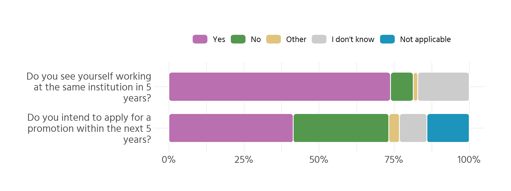
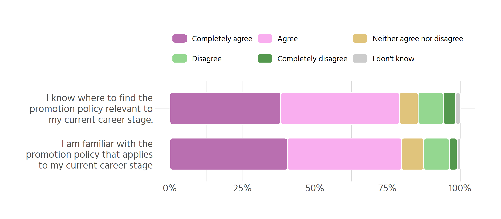
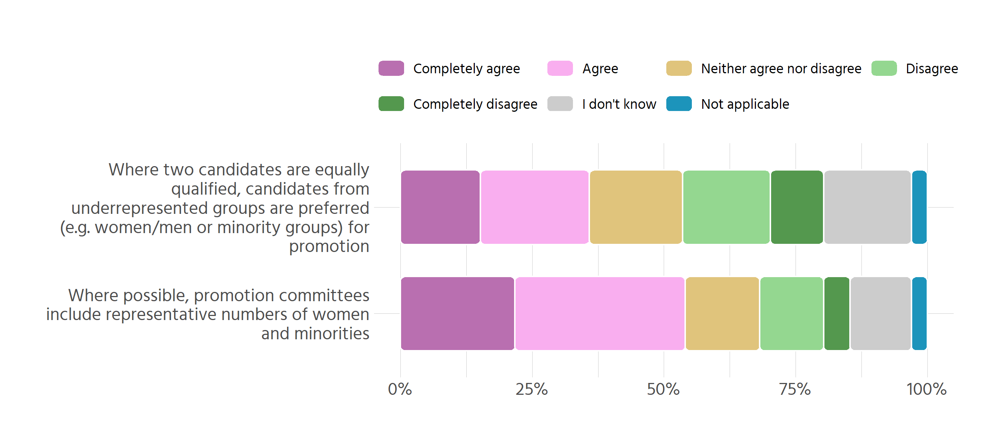
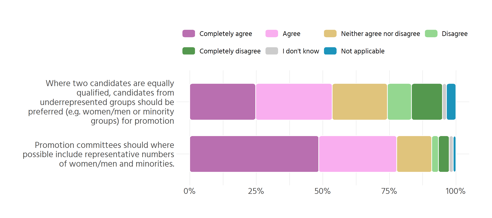

# Do you see yourself working at the same institution in 5 years? (X17)

```r
df %>% make_table(X17)
```


|X17          |   n|percent |
|:------------|---:|:-------|
|Yes          | 146|73.7%   |
|I don't know |  34|17.2%   |
|No           |  15|7.6%    |
|Other        |   3|1.5%    |
|Total        | 198|100.0%  |

```r
df %>%
  count(X18)
```

```
## # A tibble: 4 × 2
##   X18                    n
##   <chr>              <int>
## 1 probably yes           1
## 2 retiring in 1 year     1
## 3 will retire            1
## 4 <NA>                 195
```

# Do you intend to apply for a promotion within the next 5 years? (X19)

```r
df %>% make_table(X19)
```


|X19            |   n|percent |
|:--------------|---:|:-------|
|Yes            |  82|41.4%   |
|No             |  63|31.8%   |
|Not applicable |  28|14.1%   |
|I don't know   |  18|9.1%    |
|Other          |   7|3.5%    |
|Total          | 198|100.0%  |

# Combine them

```r
pdata <- df %>% 
  select(X17, X19) %>% 
  pivot_longer(everything(), names_to = "var", values_to = "val") %>% 
  count(var, val) %>% 
  group_by(var) %>% 
  mutate(percent = n/sum(n),
         val = fct_relevel(val, "Yes", "No", "Other", "I don't know", 
                           "Not applicable"))

pdata <- pdata %>% 
  mutate(var = case_when(
    var == "X17" ~ "Do you see yourself working at the same institution in 5 years?",
    TRUE ~ "Do you intend to apply for a promotion within the next 5 years?"),
         var = str_wrap(var, 30))

pdata %>% 
  ggplot(aes(var, percent, fill = val)) +
  geom_chicklet(width = .7) +
  coord_flip() +
  scale_y_continuous(labels = scales::percent) +
  scale_fill_manual(values = c(
    "Yes" = "#B96FB0",
    "No" = "#54984E",
    "Other" = "#E0C47C",
    "I don't know" = "grey80", #C9D1F9
    "Not applicable" = "#1C94BB"
  )) +
  labs(x = NULL, y = NULL, fill = NULL) +
  theme(legend.position = "top")
```

<!-- -->


```r
pdata %>% 
  mutate(var = str_replace_all(var, "\\n", " ")) %>% 
  arrange(var, val) %>% 
  knitr::kable()
```


|var                                                             |val            |   n|   percent|
|:---------------------------------------------------------------|:--------------|---:|---------:|
|Do you intend to apply for a promotion within the next 5 years? |Yes            |  82| 0.4141414|
|Do you intend to apply for a promotion within the next 5 years? |No             |  63| 0.3181818|
|Do you intend to apply for a promotion within the next 5 years? |Other          |   7| 0.0353535|
|Do you intend to apply for a promotion within the next 5 years? |I don't know   |  18| 0.0909091|
|Do you intend to apply for a promotion within the next 5 years? |Not applicable |  28| 0.1414141|
|Do you see yourself working at the same institution in 5 years? |Yes            | 146| 0.7373737|
|Do you see yourself working at the same institution in 5 years? |No             |  15| 0.0757576|
|Do you see yourself working at the same institution in 5 years? |Other          |   3| 0.0151515|
|Do you see yourself working at the same institution in 5 years? |I don't know   |  34| 0.1717172|

# Familiarity with promotion policy (X21, X22)

- "For each of the statements below provide your personal level of agreement or disagreement: [I know where to find the promotion policy relevant to my current career stage as a researcher (e.g. institution’s website, intranet or handbook)]"


```r
df %>% 
  filter(X21 != "Not applicable") %>% 
  make_table(X21, sort = FALSE)
```


|X21                        |   n|percent |
|:--------------------------|---:|:-------|
|Agree                      |  76|40.9%   |
|Completely agree           |  71|38.2%   |
|Completely disagree        |   8|4.3%    |
|Disagree                   |  16|8.6%    |
|I don't know               |   3|1.6%    |
|Neither agree nor disagree |  12|6.5%    |
|Total                      | 186|100.0%  |


- For each of the statements below provide your personal level of agreement or disagreement: [I am familiar with the promotion policy that applies to my current career stage]


```r
df %>% 
  filter(X22 != "Not applicable") %>% 
  make_table(X22, sort = FALSE)
```


|X22                        |   n|percent |
|:--------------------------|---:|:-------|
|Agree                      |  72|39.3%   |
|Completely agree           |  74|40.4%   |
|Completely disagree        |   5|2.7%    |
|Disagree                   |  16|8.7%    |
|I don't know               |   2|1.1%    |
|Neither agree nor disagree |  14|7.7%    |
|Total                      | 183|100.0%  |

## Combine both


```r
pdata <- df %>% 
  select(X21, X22) %>% 
  pivot_longer(everything(), names_to = "var", values_to = "val") %>% 
  filter(val != "Not applicable") %>% 
  count(var, val) %>% 
  group_by(var) %>% 
  mutate(percent = n/sum(n),
         val = fct_relevel(val, "Completely agree", "Agree", 
                           "Neither agree nor disagree", "Disagree",
                           "Completely disagree", "I don't know"))

pdata <- pdata %>% 
  mutate(var = case_when(
    var == "X21" ~ "I know where to find the promotion policy relevant to my current career stage.",
    TRUE ~ "I am familiar with the promotion policy that applies to my current career stage"),
         var = str_wrap(var, 30))

pdata %>% 
  ggplot(aes(var, percent, fill = val)) +
  geom_chicklet(width = .7) +
  coord_flip() +
  scale_y_continuous(labels = scales::percent) +
  scale_fill_manual(values = c("#B96FB0", "#F9AEEF", "#E0C47C", "#94D790",
                               "#54984E", "grey80")) +
  guides(fill = guide_legend(byrow = TRUE)) +
  labs(x = NULL, y = NULL, fill = NULL) +
  theme(legend.position = "top")
```

<!-- -->


```r
pdata %>%
  mutate(var = str_replace_all(var, "\\n", " ")) %>% 
  arrange(var, val) %>% 
  knitr::kable()
```


|var                                                                             |val                        |  n|   percent|
|:-------------------------------------------------------------------------------|:--------------------------|--:|---------:|
|I am familiar with the promotion policy that applies to my current career stage |Completely agree           | 74| 0.4043716|
|I am familiar with the promotion policy that applies to my current career stage |Agree                      | 72| 0.3934426|
|I am familiar with the promotion policy that applies to my current career stage |Neither agree nor disagree | 14| 0.0765027|
|I am familiar with the promotion policy that applies to my current career stage |Disagree                   | 16| 0.0874317|
|I am familiar with the promotion policy that applies to my current career stage |Completely disagree        |  5| 0.0273224|
|I am familiar with the promotion policy that applies to my current career stage |I don't know               |  2| 0.0109290|
|I know where to find the promotion policy relevant to my current career stage.  |Completely agree           | 71| 0.3817204|
|I know where to find the promotion policy relevant to my current career stage.  |Agree                      | 76| 0.4086022|
|I know where to find the promotion policy relevant to my current career stage.  |Neither agree nor disagree | 12| 0.0645161|
|I know where to find the promotion policy relevant to my current career stage.  |Disagree                   | 16| 0.0860215|
|I know where to find the promotion policy relevant to my current career stage.  |Completely disagree        |  8| 0.0430108|
|I know where to find the promotion policy relevant to my current career stage.  |I don't know               |  3| 0.0161290|


# Gender and other equality
## Institutional opinion

```r
base <- df %>%
  select(X1, X44:X45) %>%
  pivot_longer(-X1, names_to = "var", values_to = "val") 

# get labels
labels <- var_overview %>%
  filter(var_id %in% c("X44", "X45")) %>%
  mutate(label = str_extract(var_full, "(?<=\\[).*?(?=\\s?\\])")) %>%
  select(var_id, label)

combined <- base %>%
  left_join(labels, by = c("var" = "var_id")) %>%
  select(-var)

pdata <- combined %>% 
  count(label, val) %>% 
  make_proportion(group = label, var = val) %>% 
  mutate(val = fct_relevel(
    val,
    "Completely agree", "Agree", "Neither agree nor disagree", "Disagree", 
    "Completely disagree", "I don't know", "Not applicable"
  ))
```

```r
pdata %>% 
  select(-order) %>% 
  arrange(label, val) %>% 
  knitr::kable()
```


|label                                                                                                                                               |val                        |  n|      prop|
|:---------------------------------------------------------------------------------------------------------------------------------------------------|:--------------------------|--:|---------:|
|Where possible, promotion committees include representative numbers of women and minorities                                                         |Completely agree           | 43| 0.2171717|
|Where possible, promotion committees include representative numbers of women and minorities                                                         |Agree                      | 64| 0.3232323|
|Where possible, promotion committees include representative numbers of women and minorities                                                         |Neither agree nor disagree | 28| 0.1414141|
|Where possible, promotion committees include representative numbers of women and minorities                                                         |Disagree                   | 24| 0.1212121|
|Where possible, promotion committees include representative numbers of women and minorities                                                         |Completely disagree        | 10| 0.0505051|
|Where possible, promotion committees include representative numbers of women and minorities                                                         |I don't know               | 23| 0.1161616|
|Where possible, promotion committees include representative numbers of women and minorities                                                         |Not applicable             |  6| 0.0303030|
|Where two candidates are equally qualified, candidates from underrepresented groups are preferred (e.g. women/men or minority groups) for promotion |Completely agree           | 30| 0.1515152|
|Where two candidates are equally qualified, candidates from underrepresented groups are preferred (e.g. women/men or minority groups) for promotion |Agree                      | 41| 0.2070707|
|Where two candidates are equally qualified, candidates from underrepresented groups are preferred (e.g. women/men or minority groups) for promotion |Neither agree nor disagree | 35| 0.1767677|
|Where two candidates are equally qualified, candidates from underrepresented groups are preferred (e.g. women/men or minority groups) for promotion |Disagree                   | 33| 0.1666667|
|Where two candidates are equally qualified, candidates from underrepresented groups are preferred (e.g. women/men or minority groups) for promotion |Completely disagree        | 20| 0.1010101|
|Where two candidates are equally qualified, candidates from underrepresented groups are preferred (e.g. women/men or minority groups) for promotion |I don't know               | 33| 0.1666667|
|Where two candidates are equally qualified, candidates from underrepresented groups are preferred (e.g. women/men or minority groups) for promotion |Not applicable             |  6| 0.0303030|


```r
pdata %>% 
  ungroup() %>% 
  mutate(label = str_wrap(label, 40)) %>% 
  ggplot(aes(label, prop, fill = val)) +
  geom_chicklet(width = .7) +
  coord_flip() +
  scale_y_continuous(labels = scales::percent) +
  scale_fill_manual(values = c("#B96FB0", "#F9AEEF", "#E0C47C", "#94D790",
                               "#54984E", "grey80", "#1C94BB")) +
  guides(fill = guide_legend(byrow = TRUE)) +
  labs(x = NULL, y = NULL, fill = NULL) +
  theme(legend.position = "top")
```

<!-- -->

## Personal opinion


```r
base <- df %>%
  select(X1, X66:X67) %>%
  pivot_longer(-X1, names_to = "var", values_to = "val") 

# get labels
labels <- var_overview %>%
  filter(var_id %in% c("X66", "X67")) %>%
  mutate(label = str_extract(var_full, "(?<=\\[).*?(?=\\s?\\])")) %>%
  select(var_id, label)

combined <- base %>%
  left_join(labels, by = c("var" = "var_id")) %>%
  select(-var)

pdata <- combined %>% 
  count(label, val) %>% 
  make_proportion(group = label, var = val) %>% 
  mutate(val = fct_relevel(
    val,
    "Completely agree", "Agree", "Neither agree nor disagree", "Disagree", 
    "Completely disagree", "I don't know", "Not applicable"
  ))
```

```r
pdata %>% 
  select(-order) %>% 
  arrange(label, val) %>% 
  knitr::kable()
```


|label                                                                                                                                                     |val                        |  n|      prop|
|:---------------------------------------------------------------------------------------------------------------------------------------------------------|:--------------------------|--:|---------:|
|Promotion committees should where possible include representative numbers of women/men and minorities.                                                    |Completely agree           | 96| 0.4848485|
|Promotion committees should where possible include representative numbers of women/men and minorities.                                                    |Agree                      | 58| 0.2929293|
|Promotion committees should where possible include representative numbers of women/men and minorities.                                                    |Neither agree nor disagree | 26| 0.1313131|
|Promotion committees should where possible include representative numbers of women/men and minorities.                                                    |Disagree                   |  5| 0.0252525|
|Promotion committees should where possible include representative numbers of women/men and minorities.                                                    |Completely disagree        |  8| 0.0404040|
|Promotion committees should where possible include representative numbers of women/men and minorities.                                                    |I don't know               |  3| 0.0151515|
|Promotion committees should where possible include representative numbers of women/men and minorities.                                                    |Not applicable             |  2| 0.0101010|
|Where two candidates are equally qualified, candidates from underrepresented groups should be preferred (e.g. women/men or minority groups) for promotion |Completely agree           | 49| 0.2474747|
|Where two candidates are equally qualified, candidates from underrepresented groups should be preferred (e.g. women/men or minority groups) for promotion |Agree                      | 57| 0.2878788|
|Where two candidates are equally qualified, candidates from underrepresented groups should be preferred (e.g. women/men or minority groups) for promotion |Neither agree nor disagree | 41| 0.2070707|
|Where two candidates are equally qualified, candidates from underrepresented groups should be preferred (e.g. women/men or minority groups) for promotion |Disagree                   | 18| 0.0909091|
|Where two candidates are equally qualified, candidates from underrepresented groups should be preferred (e.g. women/men or minority groups) for promotion |Completely disagree        | 23| 0.1161616|
|Where two candidates are equally qualified, candidates from underrepresented groups should be preferred (e.g. women/men or minority groups) for promotion |I don't know               |  3| 0.0151515|
|Where two candidates are equally qualified, candidates from underrepresented groups should be preferred (e.g. women/men or minority groups) for promotion |Not applicable             |  7| 0.0353535|


```r
pdata %>% 
  ungroup() %>% 
  mutate(label = str_wrap(label, 40)) %>% 
  ggplot(aes(label, prop, fill = val)) +
  geom_chicklet(width = .7) +
  coord_flip() +
  scale_y_continuous(labels = scales::percent) +
  scale_fill_manual(values = c("#B96FB0", "#F9AEEF", "#E0C47C", "#94D790",
                               "#54984E", "grey80", "#1C94BB")) +
  guides(fill = guide_legend(byrow = TRUE)) +
  labs(x = NULL, y = NULL, fill = NULL) +
  theme(legend.position = "top")
```

<!-- -->
