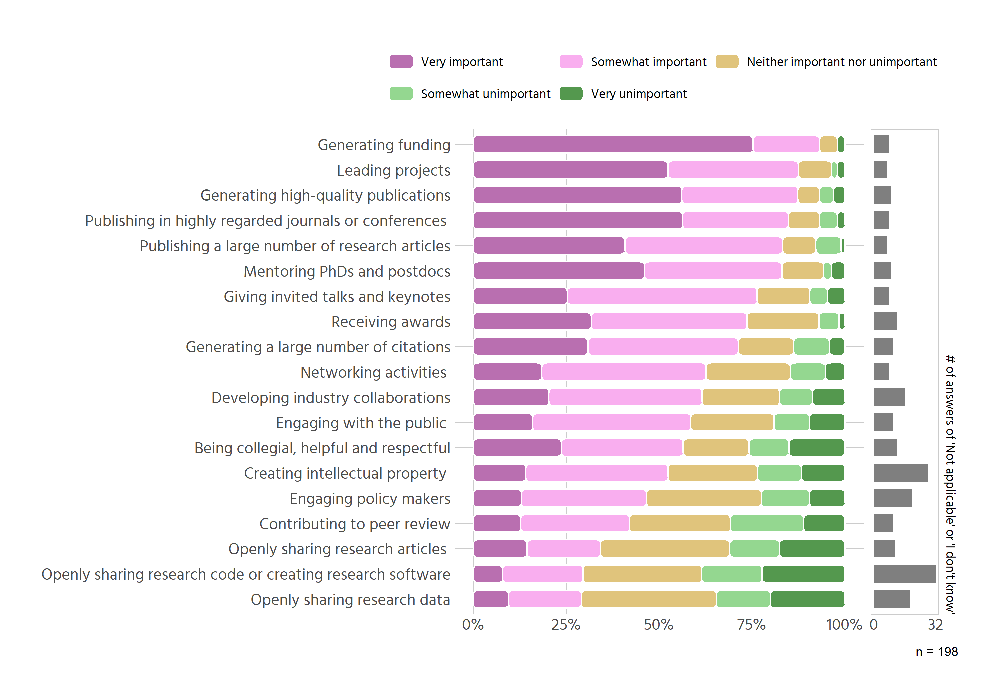
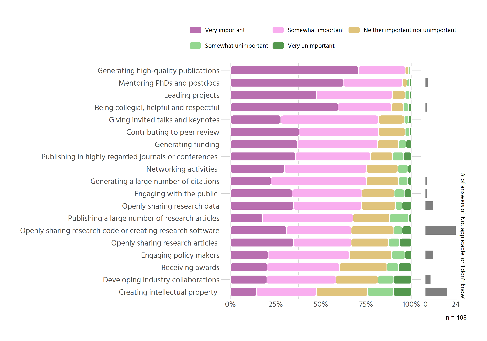
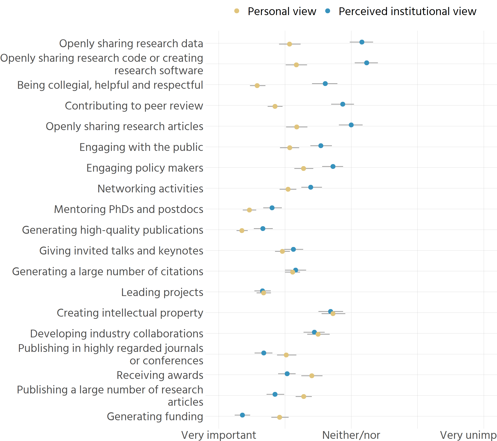
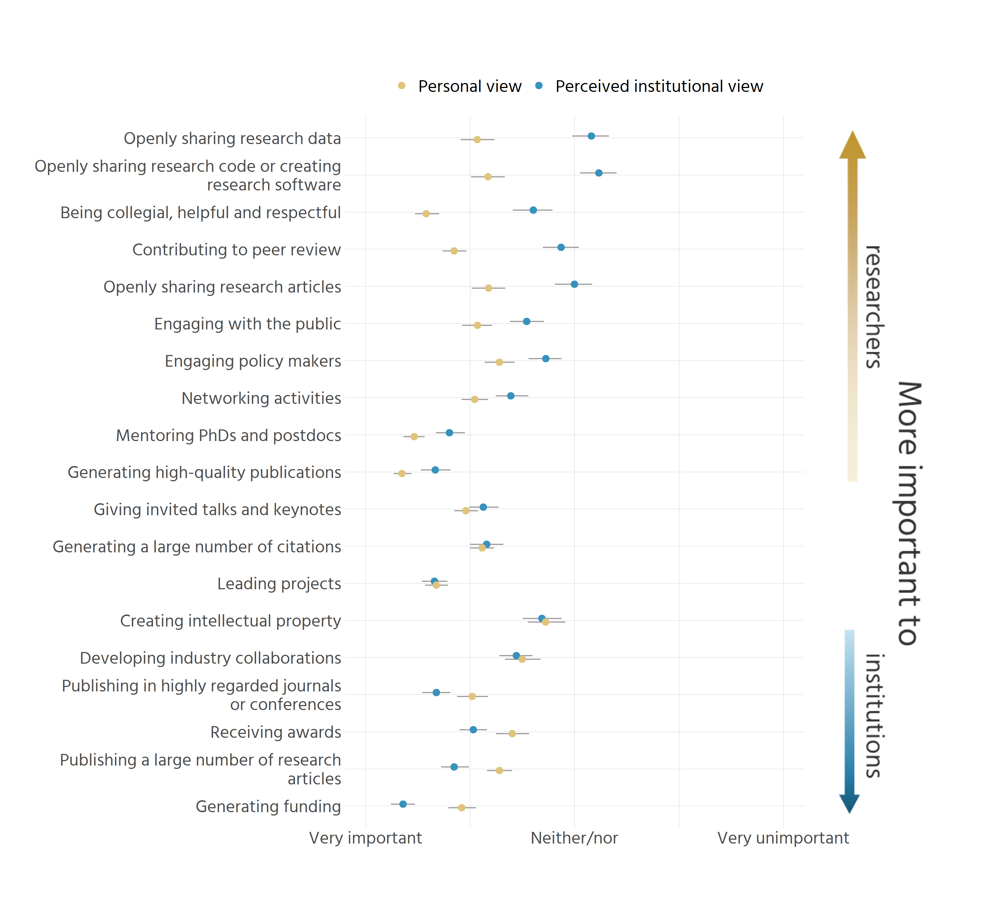
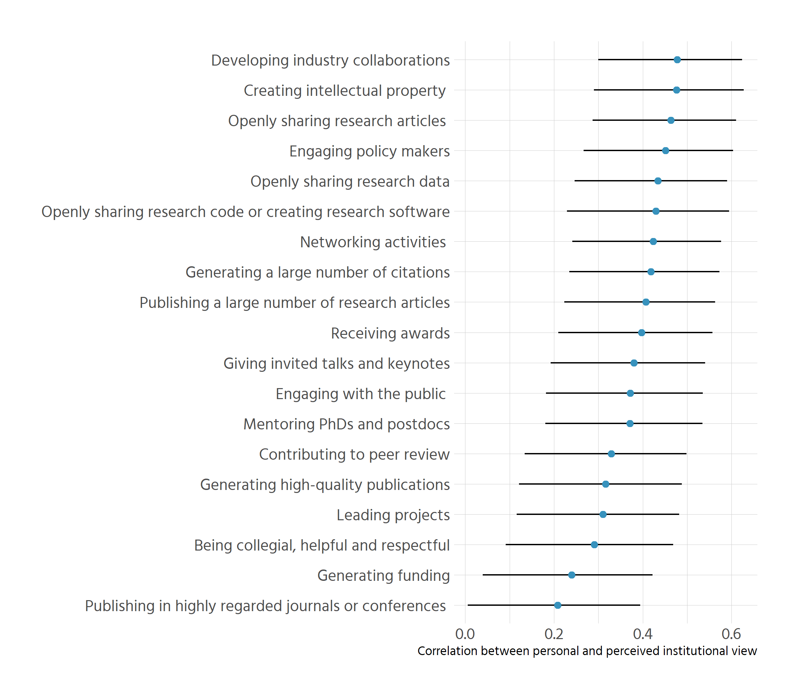
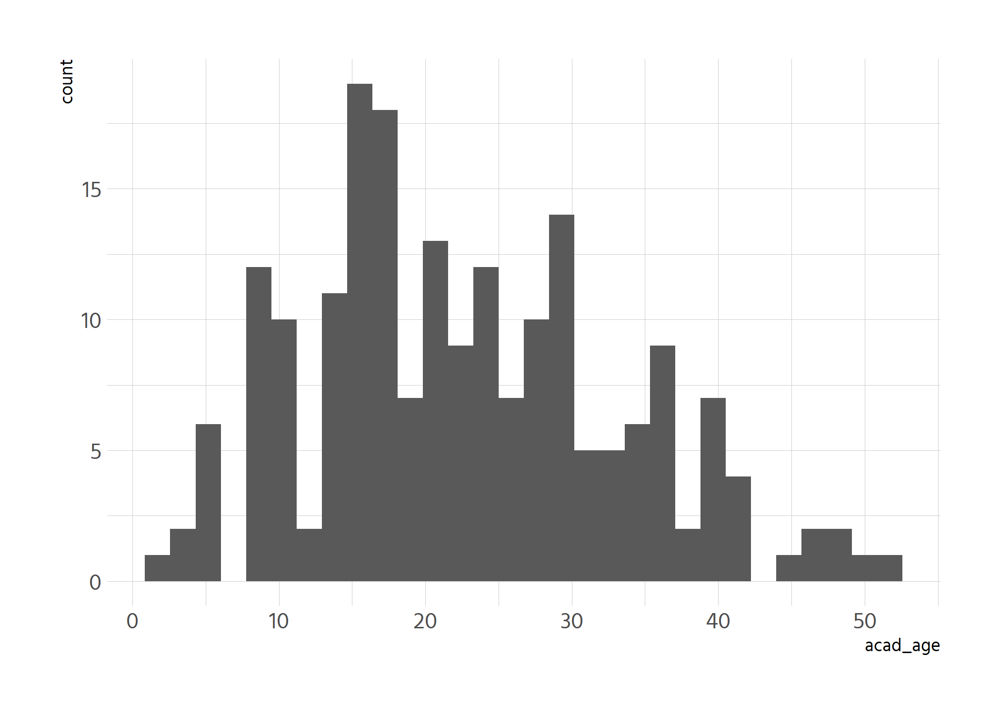
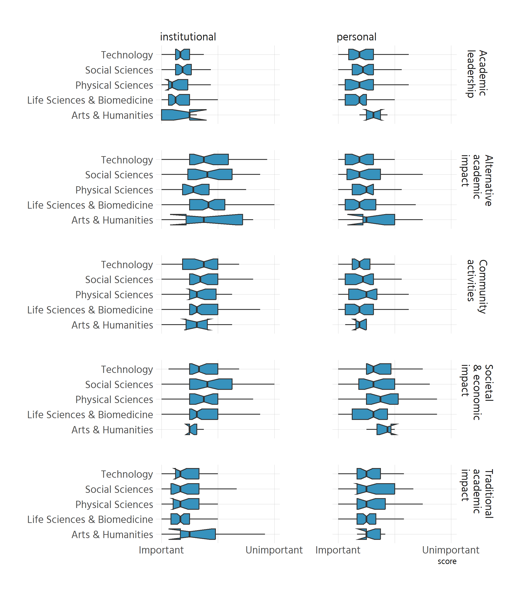
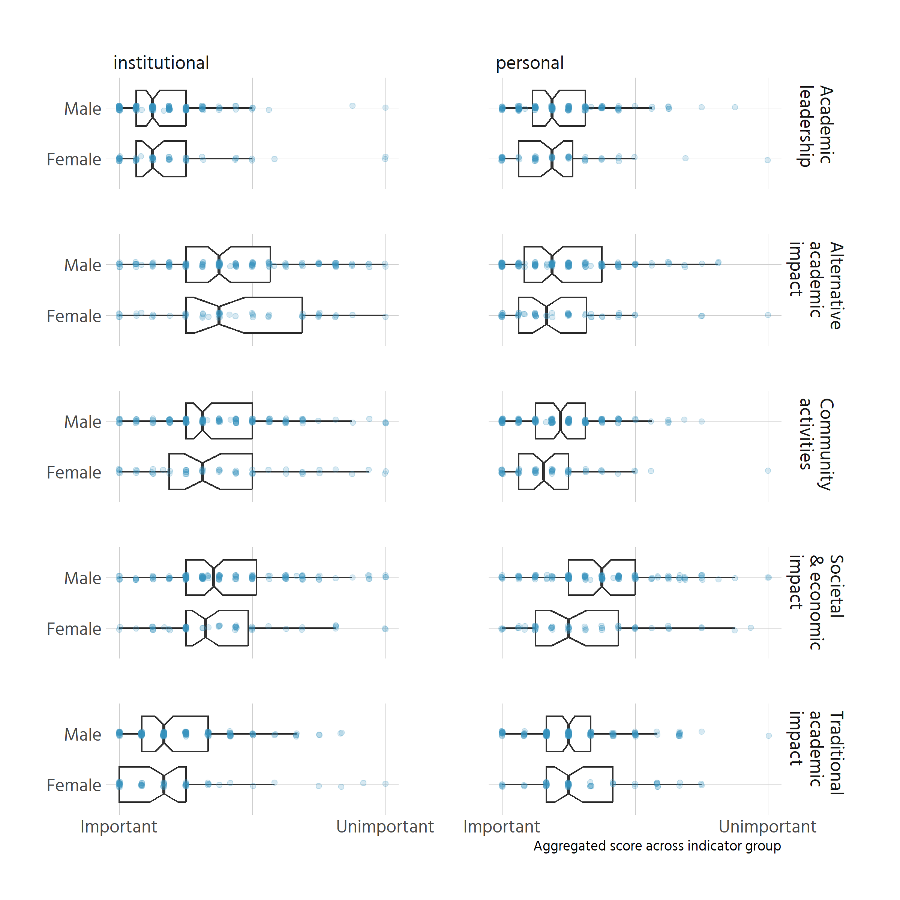
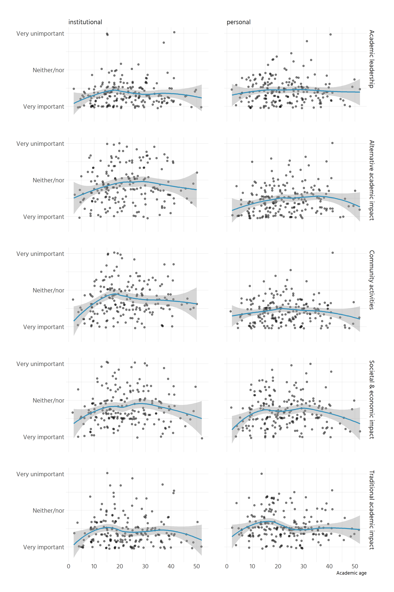

# Institutional view: X23 - X41
"According to your institutional policies, how important are the following research activities in making promotion decisions in relation to your current career stage?  [Publishing a large number of research articles]"

etc.


```r
step1 <- df %>% 
  select(X23:X41) %>% 
  pivot_longer(everything(), names_to = "var", values_to = "val") %>%
  count(var, val)
```

```
## select: dropped 54 variables (X1, X3, X7, X8, X9, …)
```

```
## pivot_longer: reorganized (X23, X24, X25, X26, X27, …) into (var, val) [was 198x19, now 3762x2]
```

```
## count: now 132 rows and 3 columns, ungrouped
```

```r
# remove dont knows and not applicables
nas <- step1 %>% 
  filter(val %in% c("I don't know", "Not applicable"))
```

```
## filter: removed 94 rows (71%), 38 rows remaining
```

```r
pdata <- step1 %>% 
  anti_join(nas) %>% 
  mutate(val = fct_relevel(val, "Very important", "Somewhat important",
                           "Neither important nor unimportant", 
                           "Somewhat unimportant", "Very unimportant")) %>% 
  make_proportion(group = var, var = val, order_string = "\\simportant$")
```

```
## Joining, by = c("var", "val", "n")
```

```
## anti_join: added no columns
```

```
##            > rows only in x   94
```

```
##            > rows only in y  ( 0)
```

```
##            > matched rows    (38)
```

```
##            >                 ====
```

```
##            > rows total       94
```

```
## mutate: converted 'val' from character to factor (0 new NA)
```

```
## group_by: one grouping variable (var)
```

```
## mutate (grouped): new variable 'prop' (double) with 83 unique values and 0% NA
```

```
##                   new variable 'order' (double) with 19 unique values and 0% NA
```

```r
# get labels
labels <- var_overview %>% 
  filter(var_id %in% paste0("X", 23:41)) %>% 
  mutate(label = str_extract(var_full, "(?<=\\[).*?(?=\\s?\\])"),
         # clean up labels
         label = str_remove(label, "\\(.*"),
         label = str_remove(label, ", as assessed .*")) %>% 
  select(var_id, label)
```

```
## filter: removed 73 rows (79%), 19 rows remaining
```

```
## mutate: new variable 'label' (character) with 19 unique values and 0% NA
```

```
## select: dropped one variable (var_full)
```

```r
pdata_institution <- pdata %>% 
  left_join(labels, by = c("var" = "var_id"))
```

```
## left_join: added one column (label)
```

```
##            > rows only in x    0
```

```
##            > rows only in y  ( 0)
```

```
##            > matched rows     94
```

```
##            >                 ====
```

```
##            > rows total       94
```


```r
pdata_institution %>% 
  ungroup() %>% 
  arrange(desc(order), val) %>% 
  mutate(prop = scales::percent(prop, accuracy = .1),
         summary = glue::glue("{n} ({prop})")) %>% 
  select(variable = label, value = val, summary) %>%
  pivot_wider(names_from = value, values_from = summary,
              values_fill = "0 (0.0%)", names_sort = TRUE) %>% 
  knitr::kable()
```

```
## ungroup: no grouping variables
```

```
## mutate: converted 'prop' from double to character (0 new NA)
```

```
##         new variable 'summary' (character) with 80 unique values and 0% NA
```

```
## select: renamed 2 variables (variable, value) and dropped 4 variables
```

```
## pivot_wider: reorganized (value, summary) into (Very important, Somewhat important, Neither important nor unimportant, Somewhat unimportant, Very unimportant) [was 94x3, now 19x6]
```


|variable                                                   |Very important |Somewhat important |Neither important nor unimportant |Somewhat unimportant |Very unimportant |
|:----------------------------------------------------------|:--------------|:------------------|:---------------------------------|:--------------------|:----------------|
|Generating funding                                         |143 (75.3%)    |34 (17.9%)         |9 (4.7%)                          |0 (0.0%)             |4 (2.1%)         |
|Leading projects                                           |100 (52.4%)    |67 (35.1%)         |17 (8.9%)                         |3 (1.6%)             |4 (2.1%)         |
|Generating high-quality publications                       |106 (56.1%)    |59 (31.2%)         |11 (5.8%)                         |7 (3.7%)             |6 (3.2%)         |
|Publishing in highly regarded journals or conferences      |107 (56.3%)    |54 (28.4%)         |16 (8.4%)                         |9 (4.7%)             |4 (2.1%)         |
|Publishing a large number of research articles             |78 (40.8%)     |81 (42.4%)         |17 (8.9%)                         |13 (6.8%)            |2 (1.0%)         |
|Mentoring PhDs and postdocs                                |87 (46.0%)     |70 (37.0%)         |21 (11.1%)                        |4 (2.1%)             |7 (3.7%)         |
|Giving invited talks and keynotes                          |48 (25.3%)     |97 (51.1%)         |27 (14.2%)                        |9 (4.7%)             |9 (4.7%)         |
|Receiving awards                                           |59 (31.7%)     |78 (41.9%)         |36 (19.4%)                        |10 (5.4%)            |3 (1.6%)         |
|Generating a large number of citations                     |58 (30.9%)     |76 (40.4%)         |28 (14.9%)                        |18 (9.6%)            |8 (4.3%)         |
|Networking activities                                      |35 (18.4%)     |84 (44.2%)         |43 (22.6%)                        |18 (9.5%)            |10 (5.3%)        |
|Developing industry collaborations                         |37 (20.3%)     |75 (41.2%)         |38 (20.9%)                        |16 (8.8%)            |16 (8.8%)        |
|Engaging with the public                                   |30 (16.0%)     |80 (42.6%)         |42 (22.3%)                        |18 (9.6%)            |18 (9.6%)        |
|Being collegial, helpful and respectful                    |44 (23.7%)     |61 (32.8%)         |33 (17.7%)                        |20 (10.8%)           |28 (15.1%)       |
|Creating intellectual property                             |24 (14.1%)     |65 (38.2%)         |41 (24.1%)                        |20 (11.8%)           |20 (11.8%)       |
|Engaging policy makers                                     |23 (12.9%)     |60 (33.7%)         |55 (30.9%)                        |23 (12.9%)           |17 (9.6%)        |
|Contributing to peer review                                |24 (12.8%)     |55 (29.3%)         |51 (27.1%)                        |37 (19.7%)           |21 (11.2%)       |
|Openly sharing research articles                           |27 (14.4%)     |37 (19.8%)         |65 (34.8%)                        |25 (13.4%)           |33 (17.6%)       |
|Openly sharing research code or creating research software |13 (7.8%)      |36 (21.7%)         |53 (31.9%)                        |27 (16.3%)           |37 (22.3%)       |
|Openly sharing research data                               |17 (9.5%)      |35 (19.6%)         |65 (36.3%)                        |26 (14.5%)           |36 (20.1%)       |


```r
# colours came from `RColorBrewer::brewer.pal("PiYG", n = 5)`, but with yellow 
# as the midpoint
# new colours: 
purple <- c('#F9AEEF', '#B96FB0') # light, dark
green <- c('#94D790', "#54984E") # light, dark
blue <- c('#86CFFB', '#3792BD') # light, dark
midpoint <- "#E0C47C"

p1 <- pdata_institution %>% 
  ggplot(aes(fct_reorder(label, order), prop, fill = val)) +
  geom_chicklet(width = .7) +
  coord_flip() +
  scale_y_continuous(labels = scales::percent) +
  scale_fill_manual(values = c("#B96FB0", "#F9AEEF", "#E0C47C", "#94D790",
                               "#54984E")) +
  theme(legend.position = "top") +
  guides(fill = guide_legend(nrow = 2, byrow = TRUE)) +
  labs(x = NULL, y = NULL, fill = NULL) 

# get missings
p_nas <- nas %>% 
  left_join(select(pdata_institution, var, order)) %>% 
  left_join(labels, by = c("var" = "var_id")) %>% 
  distinct() %>% 
  group_by(label, order) %>% 
  summarise(n = sum(n))
```

```
## select: dropped 4 variables (val, n, prop, label)
```

```
## Joining, by = "var"
## left_join: added one column (order)
## > rows only in x 0
## > rows only in y ( 0)
## > matched rows 188 (includes duplicates)
## > =====
## > rows total 188
## left_join: added one column (label)
## > rows only in x 0
## > rows only in y ( 0)
## > matched rows 188
## > =====
## > rows total 188
## distinct: removed 150 rows (80%), 38 rows remaining
## group_by: 2 grouping variables (label, order)
## summarise: now 19 rows and 3 columns, one group variable remaining (label)
```

```r
p2 <- p_nas %>% 
  ggplot(aes(y = fct_reorder(label, order), x = n)) +
  geom_col(fill = "grey50", width = .7) +
  labs(x = NULL, y = "# of answers of 'Not applicable' or 'I don't know'") +
  scale_x_continuous(breaks = c(0, 32)) +
  scale_y_discrete(position = "right") +
  hrbrtheme_fixed(grid = "", plot_margin = margin(l = 5)) +
  theme(panel.border = element_rect(fill = NA, colour = "grey80"),
        axis.text.y = element_blank(),
        axis.title.y = element_text( angle = 270))

p1 + 
  theme(plot.margin = margin()) + p2 +
  plot_layout(widths = c(6, 1)) +
  plot_annotation(caption = "n = 198")
```

<!-- -->


# Personal view: X47 - X65
"In your own personal opinion, how important should the following research activities be when making promotion decisions?  [Publishing a large number of research articles]"

etc.


```r
step1 <- df %>% 
  select(X47:X65) %>% 
  pivot_longer(everything(), names_to = "var", values_to = "val") %>%
  count(var, val)
```

```
## select: dropped 54 variables (X1, X3, X7, X8, X9, …)
```

```
## pivot_longer: reorganized (X47, X48, X49, X50, X51, …) into (var, val) [was 198x19, now 3762x2]
```

```
## count: now 108 rows and 3 columns, ungrouped
```

```r
# remove dont knows and not applicables
nas <- step1 %>% 
  filter(val %in% c("I don't know", "Not applicable"))
```

```
## filter: removed 95 rows (88%), 13 rows remaining
```

```r
pdata <- step1 %>% 
  anti_join(nas) %>% 
  mutate(val = fct_relevel(val, "Very important", "Somewhat important",
                           "Neither important nor unimportant", 
                           "Somewhat unimportant", "Very unimportant")) %>% 
  make_proportion(group = var, var = val, order_string = "\\simportant$")
```

```
## Joining, by = c("var", "val", "n")
```

```
## anti_join: added no columns
```

```
##            > rows only in x   95
```

```
##            > rows only in y  ( 0)
```

```
##            > matched rows    (13)
```

```
##            >                 ====
```

```
##            > rows total       95
```

```
## mutate: converted 'val' from character to factor (0 new NA)
```

```
## group_by: one grouping variable (var)
```

```
## mutate (grouped): new variable 'prop' (double) with 82 unique values and 0% NA
```

```
##                   new variable 'order' (double) with 18 unique values and 0% NA
```

```r
# get labels
labels <- var_overview %>% 
  filter(var_id %in% paste0("X", 47:65)) %>% 
  mutate(label = str_extract(var_full, "(?<=\\[).*?(?=\\s?\\])"),
         # clean up labels
         label = str_remove(label, "\\(.*"),
         label = str_remove(label, ", as assessed .*")) %>% 
  select(var_id, label)
```

```
## filter: removed 73 rows (79%), 19 rows remaining
```

```
## mutate: new variable 'label' (character) with 19 unique values and 0% NA
```

```
## select: dropped one variable (var_full)
```

```r
pdata_individual <- pdata %>% 
  left_join(labels, by = c("var" = "var_id"))
```

```
## left_join: added one column (label)
```

```
##            > rows only in x    0
```

```
##            > rows only in y  ( 0)
```

```
##            > matched rows     95
```

```
##            >                 ====
```

```
##            > rows total       95
```


```r
pdata_individual %>% 
  ungroup() %>% 
  arrange(desc(order), val) %>% 
  mutate(prop = scales::percent(prop, accuracy = .1),
         summary = glue::glue("{n} ({prop})")) %>% 
  select(variable = label, value = val, summary) %>%
  pivot_wider(names_from = value, values_from = summary,
              values_fill = "0 (0.0%)", names_sort = TRUE) %>% 
  knitr::kable()
```

```
## ungroup: no grouping variables
```

```
## mutate: converted 'prop' from double to character (0 new NA)
```

```
##         new variable 'summary' (character) with 75 unique values and 0% NA
```

```
## select: renamed 2 variables (variable, value) and dropped 4 variables
```

```
## pivot_wider: reorganized (value, summary) into (Very important, Somewhat important, Neither important nor unimportant, Somewhat unimportant, Very unimportant) [was 95x3, now 19x6]
```


|variable                                                   |Very important |Somewhat important |Neither important nor unimportant |Somewhat unimportant |Very unimportant |
|:----------------------------------------------------------|:--------------|:------------------|:---------------------------------|:--------------------|:----------------|
|Generating high-quality publications                       |140 (70.7%)    |51 (25.8%)         |4 (2.0%)                          |2 (1.0%)             |1 (0.5%)         |
|Mentoring PhDs and postdocs                                |122 (62.2%)    |64 (32.7%)         |5 (2.6%)                          |3 (1.5%)             |2 (1.0%)         |
|Leading projects                                           |94 (47.5%)     |83 (41.9%)         |14 (7.1%)                         |5 (2.5%)             |2 (1.0%)         |
|Being collegial, helpful and respectful                    |117 (59.4%)    |58 (29.4%)         |13 (6.6%)                         |6 (3.0%)             |3 (1.5%)         |
|Giving invited talks and keynotes                          |55 (27.8%)     |107 (54.0%)        |28 (14.1%)                        |5 (2.5%)             |3 (1.5%)         |
|Contributing to peer review                                |75 (37.9%)     |87 (43.9%)         |29 (14.6%)                        |5 (2.5%)             |2 (1.0%)         |
|Generating funding                                         |73 (36.9%)     |88 (44.4%)         |23 (11.6%)                        |8 (4.0%)             |6 (3.0%)         |
|Publishing in highly regarded journals or conferences      |71 (35.9%)     |82 (41.4%)         |24 (12.1%)                        |12 (6.1%)            |9 (4.5%)         |
|Networking activities                                      |59 (29.8%)     |90 (45.5%)         |34 (17.2%)                        |11 (5.6%)            |4 (2.0%)         |
|Generating a large number of citations                     |44 (22.3%)     |104 (52.8%)        |35 (17.8%)                        |10 (5.1%)            |4 (2.0%)         |
|Engaging with the public                                   |67 (34.0%)     |76 (38.6%)         |35 (17.8%)                        |11 (5.6%)            |8 (4.1%)         |
|Openly sharing research data                               |67 (34.9%)     |72 (37.5%)         |36 (18.8%)                        |7 (3.6%)             |10 (5.2%)        |
|Publishing a large number of research articles             |35 (17.7%)     |99 (50.0%)         |40 (20.2%)                        |21 (10.6%)           |3 (1.5%)         |
|Openly sharing research articles                           |69 (34.8%)     |63 (31.8%)         |41 (20.7%)                        |12 (6.1%)            |13 (6.6%)        |
|Openly sharing research code or creating research software |54 (31.0%)     |62 (35.6%)         |41 (23.6%)                        |8 (4.6%)             |9 (5.2%)         |
|Engaging policy makers                                     |40 (20.8%)     |86 (44.8%)         |45 (23.4%)                        |14 (7.3%)            |7 (3.6%)         |
|Receiving awards                                           |40 (20.2%)     |79 (39.9%)         |52 (26.3%)                        |13 (6.6%)            |14 (7.1%)        |
|Developing industry collaborations                         |39 (20.1%)     |74 (38.1%)         |45 (23.2%)                        |17 (8.8%)            |19 (9.8%)        |
|Creating intellectual property                             |26 (14.4%)     |60 (33.1%)         |51 (28.2%)                        |26 (14.4%)           |18 (9.9%)        |


```r
p1 <- pdata_individual %>% 
  ggplot(aes(fct_reorder(label, order), prop, fill = val)) +
  geom_chicklet(width = .7) +
  coord_flip() +
  scale_y_continuous(labels = scales::percent) +
  scale_fill_manual(values = c("#B96FB0", "#F9AEEF", "#E0C47C", "#94D790",
                               "#54984E")) +
  theme(legend.position = "top") +
  guides(fill = guide_legend(nrow = 2, byrow = TRUE)) +
  labs(x = NULL, y = NULL, fill = NULL) 

# get missings
p_nas <- nas %>% 
  full_join(distinct(pdata_individual, var, order)) %>% 
  replace_na(list(n = 0)) %>% 
  left_join(labels, by = c("var" = "var_id")) %>% 
  group_by(label, order) %>% 
  summarise(n = sum(n))
```

```
## distinct (grouped): removed 76 rows (80%), 19 rows remaining
```

```
## Joining, by = "var"
## full_join: added one column (order)
## > rows only in x 0
## > rows only in y 10
## > matched rows 13
## > ====
## > rows total 23
## replace_na: changed 10 values (43%) of 'n' (10 fewer NA)
## left_join: added one column (label)
## > rows only in x 0
## > rows only in y ( 0)
## > matched rows 23
## > ====
## > rows total 23
## group_by: 2 grouping variables (label, order)
## summarise: now 19 rows and 3 columns, one group variable remaining (label)
```

```r
p2 <- p_nas %>% 
  ggplot(aes(y = fct_reorder(label, order), x = n)) +
  geom_col(fill = "grey50", width = .7) +
  labs(x = NULL, y = "# of answers of 'Not applicable' or 'I don't know'") +
  scale_x_continuous(breaks = c(0, 24)) +
  scale_y_discrete(position = "right") +
  hrbrtheme_fixed(grid = "", plot_margin = margin(l = 5)) +
  theme(panel.border = element_rect(fill = NA, colour = "grey80"),
        axis.text.y = element_blank(),
        axis.title.y = element_text( angle = 270))

p1 + 
  theme(plot.margin = margin()) + p2 +
  plot_layout(widths = c(6, 1)) +
  plot_annotation(caption = "n = 198")
```

<!-- -->


# Comparison

```r
institutional_values <- get_values(df, X23:X41, source = "institutional", 
                                   var_overview)
```

```
## select: dropped 53 variables (X3, X7, X8, X9, X10, …)
```

```
## pivot_longer: reorganized (X23, X24, X25, X26, X27, …) into (var, val) [was 198x20, now 3762x3]
```

```
## mutate: new variable 'num_val' (integer) with 6 unique values and 6% NA
```

```
## filter: removed 244 rows (6%), 3,518 rows remaining
```

```
## mutate: new variable 'source' (character) with one unique value and 0% NA
```

```
## filter: removed 73 rows (79%), 19 rows remaining
```

```
## mutate: new variable 'label' (character) with 19 unique values and 0% NA
```

```
## select: dropped one variable (var_full)
```

```
## left_join: added one column (label)
```

```
##            > rows only in x       0
```

```
##            > rows only in y  (    0)
```

```
##            > matched rows     3,518
```

```
##            >                 =======
```

```
##            > rows total       3,518
```

```
## select: dropped one variable (var)
```

```r
personal_values <- get_values(df, X47:X65, source = "personal", 
                              var_overview)
```

```
## select: dropped 53 variables (X3, X7, X8, X9, X10, …)
```

```
## pivot_longer: reorganized (X47, X48, X49, X50, X51, …) into (var, val) [was 198x20, now 3762x3]
```

```
## mutate: new variable 'num_val' (integer) with 6 unique values and 2% NA
```

```
## filter: removed 62 rows (2%), 3,700 rows remaining
```

```
## mutate: new variable 'source' (character) with one unique value and 0% NA
```

```
## filter: removed 73 rows (79%), 19 rows remaining
```

```
## mutate: new variable 'label' (character) with 19 unique values and 0% NA
```

```
## select: dropped one variable (var_full)
```

```
## left_join: added one column (label)
```

```
##            > rows only in x       0
```

```
##            > rows only in y  (    0)
```

```
##            > matched rows     3,700
```

```
##            >                 =======
```

```
##            > rows total       3,700
```

```
## select: dropped one variable (var)
```

```r
institutional_scores <- bootstrap_values(institutional_values)
```

```
## group_by: 2 grouping variables (label, source)
```

```
## summarise: now 19 rows and 3 columns, one group variable remaining (label)
```

```r
personal_scores <- bootstrap_values(personal_values)
```

```
## group_by: 2 grouping variables (label, source)
## summarise: now 19 rows and 3 columns, one group variable remaining (label)
```

```r
all_scores <- bind_rows(institutional_scores, personal_scores)
all_scores
```

```
## # A tibble: 38 × 5
## # Groups:   label [19]
##    label                                     source         Mean Lower Upper
##    <chr>                                     <chr>         <dbl> <dbl> <dbl>
##  1 "Being collegial, helpful and respectful" institutional  2.61  2.41  2.79
##  2 "Contributing to peer review"             institutional  2.87  2.70  3.04
##  3 "Creating intellectual property "         institutional  2.69  2.51  2.88
##  4 "Developing industry collaborations"      institutional  2.45  2.28  2.60
##  5 "Engaging policy makers"                  institutional  2.72  2.56  2.88
##  6 "Engaging with the public "               institutional  2.54  2.38  2.71
##  7 "Generating a large number of citations"  institutional  2.16  2     2.32
##  8 "Generating funding"                      institutional  1.36  1.24  1.47
##  9 "Generating high-quality publications"    institutional  1.67  1.53  1.81
## 10 "Giving invited talks and keynotes"       institutional  2.13  1.99  2.27
## # … with 28 more rows
```

```r
# compute differences
differences <- all_scores %>% 
  select(label, Mean, source) %>% 
  pivot_wider(names_from = source, values_from = Mean) %>% 
  mutate(diff = personal - institutional) 
```

```
## select: dropped 2 variables (Lower, Upper)
```

```
## pivot_wider: reorganized (Mean, source) into (institutional, personal) [was 38x3, now 19x3]
```

```
## mutate (grouped): new variable 'diff' (double) with 19 unique values and 0% NA
```

```r
differences %>% 
  rename(Question = label) %>% 
  arrange(diff) %>% 
  mutate(across(where(is.numeric), ~round(.x, digits = 2))) %>% 
  knitr::kable()
```

```
## rename: renamed one variable (Question)
```

```
## mutate (grouped): changed 18 values (95%) of 'institutional' (0 new NA)
```

```
##                   changed 18 values (95%) of 'personal' (0 new NA)
```

```
##                   changed 19 values (100%) of 'diff' (0 new NA)
```


|Question                                                   | institutional| personal|  diff|
|:----------------------------------------------------------|-------------:|--------:|-----:|
|Openly sharing research data                               |          3.16|     2.07| -1.09|
|Openly sharing research code or creating research software |          3.23|     2.17| -1.06|
|Being collegial, helpful and respectful                    |          2.61|     1.58| -1.03|
|Contributing to peer review                                |          2.87|     1.85| -1.02|
|Openly sharing research articles                           |          3.00|     2.18| -0.82|
|Engaging with the public                                   |          2.54|     2.07| -0.47|
|Engaging policy makers                                     |          2.72|     2.28| -0.44|
|Networking activities                                      |          2.39|     2.05| -0.34|
|Mentoring PhDs and postdocs                                |          1.80|     1.46| -0.34|
|Generating high-quality publications                       |          1.67|     1.35| -0.32|
|Giving invited talks and keynotes                          |          2.13|     1.96| -0.17|
|Generating a large number of citations                     |          2.16|     2.12| -0.04|
|Leading projects                                           |          1.66|     1.68|  0.02|
|Creating intellectual property                             |          2.69|     2.72|  0.04|
|Developing industry collaborations                         |          2.45|     2.50|  0.05|
|Publishing in highly regarded journals or conferences      |          1.68|     2.02|  0.34|
|Receiving awards                                           |          2.03|     2.40|  0.37|
|Publishing a large number of research articles             |          1.85|     2.28|  0.43|
|Generating funding                                         |          1.36|     1.92|  0.56|


```r
final_scores <- all_scores %>% 
  left_join(differences) %>% 
  select(-institutional, -personal)
```

```
## Joining, by = "label"
## left_join: added 3 columns (institutional, personal, diff)
## > rows only in x 0
## > rows only in y ( 0)
## > matched rows 38
## > ====
## > rows total 38
## select: dropped 2 variables (institutional, personal)
```

```r
final_scores
```

```
## # A tibble: 38 × 6
## # Groups:   label [19]
##    label                                     source     Mean Lower Upper    diff
##    <chr>                                     <chr>     <dbl> <dbl> <dbl>   <dbl>
##  1 "Being collegial, helpful and respectful" institut…  2.61  2.41  2.79 -1.03  
##  2 "Contributing to peer review"             institut…  2.87  2.70  3.04 -1.02  
##  3 "Creating intellectual property "         institut…  2.69  2.51  2.88  0.0355
##  4 "Developing industry collaborations"      institut…  2.45  2.28  2.60  0.0549
##  5 "Engaging policy makers"                  institut…  2.72  2.56  2.88 -0.443 
##  6 "Engaging with the public "               institut…  2.54  2.38  2.71 -0.471 
##  7 "Generating a large number of citations"  institut…  2.16  2     2.32 -0.0428
##  8 "Generating funding"                      institut…  1.36  1.24  1.47  0.561 
##  9 "Generating high-quality publications"    institut…  1.67  1.53  1.81 -0.318 
## 10 "Giving invited talks and keynotes"       institut…  2.13  1.99  2.27 -0.167 
## # … with 28 more rows
```


```r
dodge_width <- .2

custom_blue <- "#3792BD"
yellow <- "#E0C47C"
# "#F9AEEF", "#E0C47C", "#94D790",

bigger_text_size <- 15

pdata <- final_scores %>% 
  mutate(source = recode(source, personal = "Personal view", 
                         institutional = "Perceived institutional view"))
```

```
## mutate (grouped): changed 38 values (100%) of 'source' (0 new NA)
```

```r
comparison <- pdata %>% 
  ggplot(aes(Mean, fct_rev(fct_reorder(str_wrap(label, 40), diff)))) +
  geom_linerange(aes(xmin = Lower, xmax = Upper, group = fct_rev(source)),
                 position = position_dodge(width = dodge_width),
                 colour = "grey60") +
  geom_point(aes(colour = fct_rev(source)), size = 2.6,
             position = position_dodge(width = dodge_width)) +
  five_point_scale() +
  scale_colour_manual(values = c(
    `Personal view` =  yellow, #"#B96FB0",
    `Perceived institutional view` = custom_blue #"#54984E"
  )) +
  labs(y = NULL, colour = NULL, x = NULL) +
  theme(legend.position = "top", plot.margin = margin(), 
        legend.text = element_text(size = bigger_text_size),
        axis.text.y = element_text(size = bigger_text_size),
        axis.text.x = element_text(size = bigger_text_size))
comparison
```

<!-- -->

# Combine them

```r
arrows <- png::readPNG(here::here("analysis-notebooks/comparison-addition.PNG"),
                       native = TRUE)
comparison + wrap_elements(panel = arrows) +
  plot_layout(widths = c(5, 1))
```

<!-- -->

# Correlational analysis
Wondering: are correlations within individuals similar to above picture, or is 
this another angle?


```r
cor_data <- bind_rows(personal_values, institutional_values) %>% 
  select(-val) %>% 
  pivot_wider(names_from = "source", values_from = "num_val") %>% 
  group_by(label)
```

```
## select: dropped one variable (val)
```

```
## pivot_wider: reorganized (num_val, source) into (personal, institutional) [was 7218x4, now 3720x4]
```

```
## group_by: one grouping variable (label)
```

```r
cor_data %>% 
  summarise(correlation = cor(personal, institutional, use = "pairwise",
                              method = "spearman")) %>% 
  arrange(correlation) %>% 
  mutate(correlation = round(correlation, 3))
```

```
## summarise: now 19 rows and 2 columns, ungrouped
```

```
## mutate: changed 19 values (100%) of 'correlation' (0 new NA)
```

```
## # A tibble: 19 × 2
##    label                                                        correlation
##    <chr>                                                              <dbl>
##  1 "Generating funding"                                               0.175
##  2 "Publishing in highly regarded journals or conferences "           0.258
##  3 "Generating high-quality publications"                             0.307
##  4 "Leading projects"                                                 0.313
##  5 "Giving invited talks and keynotes"                                0.319
##  6 "Contributing to peer review"                                      0.332
##  7 "Being collegial, helpful and respectful"                          0.336
##  8 "Engaging with the public "                                        0.369
##  9 "Publishing a large number of research articles"                   0.396
## 10 "Receiving awards"                                                 0.398
## 11 "Mentoring PhDs and postdocs"                                      0.407
## 12 "Networking activities "                                           0.409
## 13 "Generating a large number of citations"                           0.422
## 14 "Openly sharing research code or creating research software"       0.423
## 15 "Openly sharing research data"                                     0.429
## 16 "Openly sharing research articles "                                0.438
## 17 "Developing industry collaborations"                               0.459
## 18 "Engaging policy makers"                                           0.459
## 19 "Creating intellectual property "                                  0.478
```


```r
conf_ints <- cor_data %>% 
  summarise(res = list(cor.test(personal, institutional, conf.level = .995))) %>% 
  mutate(cor = map_dbl(res, pluck, "estimate"),
         conf_int = map(res, pluck, "conf.int"),
         lower = map_dbl(conf_int, pluck, 1),
         upper = map_dbl(conf_int, pluck, 2)) %>% 
  select(label, cor, lower, upper) %>% 
  arrange(cor)
```

```
## summarise: now 19 rows and 2 columns, ungrouped
```

```
## mutate: new variable 'cor' (double) with 19 unique values and 0% NA
```

```
##         new variable 'conf_int' (list) with 19 unique values and 0% NA
```

```
##         new variable 'lower' (double) with 19 unique values and 0% NA
```

```
##         new variable 'upper' (double) with 19 unique values and 0% NA
```

```
## select: dropped 2 variables (res, conf_int)
```

```r
conf_ints
```

```
## # A tibble: 19 × 4
##    label                                                       cor   lower upper
##    <chr>                                                     <dbl>   <dbl> <dbl>
##  1 "Publishing in highly regarded journals or conferences "  0.208 0.00600 0.394
##  2 "Generating funding"                                      0.240 0.0395  0.422
##  3 "Being collegial, helpful and respectful"                 0.291 0.0913  0.468
##  4 "Leading projects"                                        0.310 0.116   0.482
##  5 "Generating high-quality publications"                    0.316 0.121   0.488
##  6 "Contributing to peer review"                             0.329 0.134   0.499
##  7 "Mentoring PhDs and postdocs"                             0.371 0.180   0.534
##  8 "Engaging with the public "                               0.372 0.182   0.535
##  9 "Giving invited talks and keynotes"                       0.380 0.192   0.541
## 10 "Receiving awards"                                        0.397 0.210   0.557
## 11 "Publishing a large number of research articles"          0.407 0.224   0.563
## 12 "Generating a large number of citations"                  0.418 0.234   0.573
## 13 "Networking activities "                                  0.423 0.241   0.576
## 14 "Openly sharing research code or creating research softw… 0.429 0.230   0.595
## 15 "Openly sharing research data"                            0.434 0.247   0.590
## 16 "Engaging policy makers"                                  0.451 0.267   0.604
## 17 "Openly sharing research articles "                       0.464 0.287   0.610
## 18 "Creating intellectual property "                         0.476 0.290   0.627
## 19 "Developing industry collaborations"                      0.478 0.300   0.624
```


```r
conf_ints %>% 
  ggplot(aes(cor, fct_reorder(label, cor))) +
  geom_linerange(aes(xmin = lower, xmax = upper)) +
  geom_point(size = 2, colour = custom_blue) +
  labs(x = "Correlation between personal and perceived institutional view",
       y = NULL)
```

<!-- -->

There is big uncertainty in the estimates, and the linear approach inherent with
correlations might not be the right model. Following this approach,
it seems that for some 
questions personal and institutional views are more aligned than for others.
This does not follow the exact same pattern as with the above comparison.

To explore a little further how these values come about.

Now do mean differences instead of difference of means as in original analysis.


```r
cor_data %>% 
  summarise(diff = mean(personal - institutional, na.rm = TRUE)) %>% 
  arrange(diff) %>% 
  mutate(diff = round(diff, 3)) %>% 
  knitr::kable()
```

```
## summarise: now 19 rows and 2 columns, ungrouped
```

```
## mutate: changed 19 values (100%) of 'diff' (0 new NA)
```


|label                                                      |   diff|
|:----------------------------------------------------------|------:|
|Openly sharing research data                               | -1.107|
|Being collegial, helpful and respectful                    | -1.049|
|Contributing to peer review                                | -1.048|
|Openly sharing research code or creating research software | -1.006|
|Openly sharing research articles                           | -0.856|
|Engaging with the public                                   | -0.492|
|Engaging policy makers                                     | -0.463|
|Networking activities                                      | -0.358|
|Mentoring PhDs and postdocs                                | -0.326|
|Generating high-quality publications                       | -0.307|
|Giving invited talks and keynotes                          | -0.168|
|Developing industry collaborations                         | -0.022|
|Generating a large number of citations                     | -0.021|
|Creating intellectual property                             |  0.006|
|Leading projects                                           |  0.021|
|Publishing in highly regarded journals or conferences      |  0.347|
|Receiving awards                                           |  0.355|
|Publishing a large number of research articles             |  0.450|
|Generating funding                                         |  0.563|

This is not identical but very close to our original figure.


```r
cor_data %>% 
  filter(str_detect(label, "Openly.*")) %>% 
  tabyl(personal, institutional) %>% 
  custom_adorns() %>% 
  knitr::kable()
```

```
## filter (grouped): removed 3,146 rows (85%), 574 rows remaining
```


|personal |1          |2           |3           |4          |5           |NA_        |Total        |
|:--------|:----------|:-----------|:-----------|:----------|:-----------|:----------|:------------|
|1        |24.2% (46) |24.7%  (47) |23.7%  (45) |11.6% (22) |8.4%  (16)  |7.4% (14)  |100.0% (190) |
|2        |4.6%  (9)  |27.4%  (54) |36.5%  (72) |8.1% (16)  |18.3%  (36) |5.1% (10)  |100.0% (197) |
|3        |1.7%  (2)  |5.1%   (6)  |45.8%  (54) |22.0% (26) |16.9%  (20) |8.5% (10)  |100.0% (118) |
|4        |0.0%  (0)  |3.7%   (1)  |18.5%   (5) |25.9%  (7) |37.0%  (10) |14.8%  (4) |100.0%  (27) |
|5        |0.0%  (0)  |0.0%   (0)  |12.5%   (4) |18.8%  (6) |56.2%  (18) |12.5%  (4) |100.0%  (32) |
|NA       |0.0%  (0)  |0.0%   (0)  |30.0%   (3) |10.0%  (1) |60.0%   (6) |0.0%  (0)  |100.0%  (10) |
|Total    |9.9% (57)  |18.8% (108) |31.9% (183) |13.6% (78) |18.5% (106) |7.3% (42)  |100.0% (574) |


```r
cor_data %>% 
  filter(str_detect(label, "highly regarded")) %>% 
  tabyl(personal, institutional) %>% 
  custom_adorns() %>% 
  knitr::kable()
```

```
## filter (grouped): removed 3,522 rows (95%), 198 rows remaining
```


|personal |1           |2          |3          |4         |5        |NA_      |Total        |
|:--------|:-----------|:----------|:----------|:---------|:--------|:--------|:------------|
|1        |67.6%  (48) |15.5% (11) |8.5%  (6)  |2.8% (2)  |1.4% (1) |4.2% (3) |100.0%  (71) |
|2        |53.7%  (44) |32.9% (27) |4.9%  (4)  |2.4% (2)  |1.2% (1) |4.9% (4) |100.0%  (82) |
|3        |29.2%   (7) |41.7% (10) |8.3%  (2)  |12.5% (3) |8.3% (2) |0.0% (0) |100.0%  (24) |
|4        |33.3%   (4) |16.7%  (2) |25.0%  (3) |16.7% (2) |0.0% (0) |8.3% (1) |100.0%  (12) |
|5        |44.4%   (4) |44.4%  (4) |11.1%  (1) |0.0% (0)  |0.0% (0) |0.0% (0) |100.0%   (9) |
|Total    |54.0% (107) |27.3% (54) |8.1% (16)  |4.5% (9)  |2.0% (4) |4.0% (8) |100.0% (198) |


```r
cor_data %>% 
  filter(str_detect(label, "code")) %>% 
  tabyl(personal, institutional) %>% 
  custom_adorns() %>% 
  knitr::kable()
```

```
## filter (grouped): removed 3,538 rows (95%), 182 rows remaining
```


|personal |1          |2          |3          |4          |5          |NA_        |Total        |
|:--------|:----------|:----------|:----------|:----------|:----------|:----------|:------------|
|1        |20.4% (11) |27.8% (15) |24.1% (13) |13.0%  (7) |7.4%  (4)  |7.4%  (4)  |100.0%  (54) |
|2        |1.6%  (1)  |30.6% (19) |29.0% (18) |9.7%  (6)  |19.4% (12) |9.7%  (6)  |100.0%  (62) |
|3        |2.4%  (1)  |2.4%  (1)  |43.9% (18) |19.5%  (8) |19.5%  (8) |12.2%  (5) |100.0%  (41) |
|4        |0.0%  (0)  |12.5%  (1) |12.5%  (1) |25.0%  (2) |37.5%  (3) |12.5%  (1) |100.0%   (8) |
|5        |0.0%  (0)  |0.0%  (0)  |11.1%  (1) |33.3%  (3) |55.6%  (5) |0.0%  (0)  |100.0%   (9) |
|NA       |0.0%  (0)  |0.0%  (0)  |25.0%  (2) |12.5%  (1) |62.5%  (5) |0.0%  (0)  |100.0%   (8) |
|Total    |7.1% (13)  |19.8% (36) |29.1% (53) |14.8% (27) |20.3% (37) |8.8% (16)  |100.0% (182) |

# Summarise indicators into groups

```r
all_Values <- bind_rows(institutional_values, personal_values) %>% 
  mutate(label = str_remove(label, "\\s$")) %>% 
  left_join(expanded_labels) %>% 
  rename(id = X1)
```

```
## mutate: changed 1,897 values (26%) of 'label' (0 new NA)
```

```
## Joining, by = "label"
## left_join: added one column (group)
## > rows only in x 0
## > rows only in y ( 0)
## > matched rows 7,218
## > =======
## > rows total 7,218
## rename: renamed one variable (id)
```

```r
all_Values
```

```
## # A tibble: 7,218 × 6
##       id val                               num_val source        label     group
##    <dbl> <chr>                               <int> <chr>         <chr>     <chr>
##  1    10 Very important                          1 institutional Publishi… Trad…
##  2    10 Very important                          1 institutional Generati… Trad…
##  3    10 Very important                          1 institutional Generati… Alte…
##  4    10 Somewhat important                      2 institutional Publishi… Trad…
##  5    10 Neither important nor unimportant       3 institutional Openly s… Alte…
##  6    10 Neither important nor unimportant       3 institutional Openly s… Alte…
##  7    10 Neither important nor unimportant       3 institutional Openly s… Alte…
##  8    10 Neither important nor unimportant       3 institutional Engaging… Soci…
##  9    10 Somewhat important                      2 institutional Developi… Soci…
## 10    10 Somewhat important                      2 institutional Creating… Soci…
## # … with 7,208 more rows
```


```r
scores_by_individual <- all_Values %>% 
  group_by(id, group, source) %>% 
  summarise(score = mean(num_val))
```

```
## group_by: 3 grouping variables (id, group, source)
```

```
## summarise: now 1,947 rows and 4 columns, 2 group variables remaining (id, group)
```


```r
demographics <- df %>% 
  select(id = X1, disciplines_recoded_wos, acad_age = X87, gender = X84,
         acad_rol = X85) %>% 
  mutate(# fix two cases where data was entered incorrectly
         acad_age = case_when(acad_age == 19999 ~ 1999,
                              acad_age == 84 ~ 1984,
                              TRUE ~ acad_age),
         acad_age = 2021 - acad_age)
```

```
## select: renamed 4 variables (id, acad_age, gender, acad_rol) and dropped 68 variables
```

```
## mutate: changed 198 values (100%) of 'acad_age' (0 new NA)
```


```r
demographics %>% 
  ggplot(aes(acad_age)) +
  geom_histogram()
```

```
## `stat_bin()` using `bins = 30`. Pick better value with `binwidth`.
```

<!-- -->


```r
scores_by_individual <- scores_by_individual %>% 
  left_join(demographics)
```

```
## Joining, by = "id"
## left_join: added 4 columns (disciplines_recoded_wos, acad_age, gender,
## acad_rol)
## > rows only in x 0
## > rows only in y ( 0)
## > matched rows 1,947
## > =======
## > rows total 1,947
```

```r
scores_by_individual
```

```
## # A tibble: 1,947 × 8
## # Groups:   id, group [990]
##       id group                       source score disci…¹ acad_…² gender acad_…³
##    <dbl> <chr>                       <chr>  <dbl> <chr>     <dbl> <chr>  <chr>  
##  1    10 Academic leadership         insti…  1.5  Physic…      36 Male   Profes…
##  2    10 Academic leadership         perso…  1.75 Physic…      36 Male   Profes…
##  3    10 Alternative academic impact insti…  2.5  Physic…      36 Male   Profes…
##  4    10 Alternative academic impact perso…  2.5  Physic…      36 Male   Profes…
##  5    10 Community activities        insti…  3.25 Physic…      36 Male   Profes…
##  6    10 Community activities        perso…  2.75 Physic…      36 Male   Profes…
##  7    10 Societal & economic impact  insti…  2.5  Physic…      36 Male   Profes…
##  8    10 Societal & economic impact  perso…  2.5  Physic…      36 Male   Profes…
##  9    10 Traditional academic impact insti…  1.33 Physic…      36 Male   Profes…
## 10    10 Traditional academic impact perso…  1.33 Physic…      36 Male   Profes…
## # … with 1,937 more rows, and abbreviated variable names
## #   ¹​disciplines_recoded_wos, ²​acad_age, ³​acad_rol
```

## by disciplines

```r
scores_by_individual %>% 
  mutate(group = str_wrap(group, width = 12)) %>% 
  filter(!is.na(disciplines_recoded_wos)) %>% 
  ggplot(aes(score, disciplines_recoded_wos)) +
  geom_boxplot(width = .7, outlier.alpha = 0, notch = TRUE, 
               fill = custom_blue) +
  #geom_jitter(height = .1, width = .01, colour = custom_blue, alpha = .5) +
  five_point_scale(compact = TRUE) +
  facet_grid(rows = vars(group), cols = vars(source)) +
  labs(y = NULL) +
  theme(panel.spacing.x = unit(4, "lines"))
```

```
## mutate (grouped): changed 1,947 values (100%) of 'group' (0 new NA)
```

```
## filter (grouped): removed 10 rows (1%), 1,937 rows remaining
```

```
## Notch went outside hinges
## ℹ Do you want `notch = FALSE`?
## Notch went outside hinges
## ℹ Do you want `notch = FALSE`?
## Notch went outside hinges
## ℹ Do you want `notch = FALSE`?
## Notch went outside hinges
## ℹ Do you want `notch = FALSE`?
## Notch went outside hinges
## ℹ Do you want `notch = FALSE`?
## Notch went outside hinges
## ℹ Do you want `notch = FALSE`?
## Notch went outside hinges
## ℹ Do you want `notch = FALSE`?
## Notch went outside hinges
## ℹ Do you want `notch = FALSE`?
## Notch went outside hinges
## ℹ Do you want `notch = FALSE`?
## Notch went outside hinges
## ℹ Do you want `notch = FALSE`?
## Notch went outside hinges
## ℹ Do you want `notch = FALSE`?
## Notch went outside hinges
## ℹ Do you want `notch = FALSE`?
## Notch went outside hinges
## ℹ Do you want `notch = FALSE`?
## Notch went outside hinges
## ℹ Do you want `notch = FALSE`?
## Notch went outside hinges
## ℹ Do you want `notch = FALSE`?
```

<!-- -->

No substantive differences. Sample size is too small to allow drawing 
conclusions here, since precisions would need to be much higher, given that we
are conducting a large number of comparisons at once. 

## by gender

```r
scores_by_individual %>% 
  mutate(group = str_wrap(group, width = 12)) %>% 
  filter(!is.na(gender), gender != "Prefer not to say") %>% 
  ggplot(aes(score, gender)) +
  geom_boxplot(width = .7, outlier.alpha = 0, notch = TRUE) +
  geom_jitter(height = .05, width = .01, colour = custom_blue, alpha = .2) +
  facet_grid(rows = vars(group), cols = vars(source)) +
  five_point_scale(compact = TRUE) +
  theme(panel.spacing.x = unit(4, "lines")) +
  labs(y = NULL, x = "Aggregated score across indicator group")
```

```
## mutate (grouped): changed 1,947 values (100%) of 'group' (0 new NA)
```

```
## filter (grouped): removed 20 rows (1%), 1,927 rows remaining
```

<!-- -->

There are no differences regarding the institutional side. Regarding personal
views, women tend to give higher importance to community activities and
societal and economic impact than men, all other aspects being similar.

This finding should be backed up by checking the gender distribution across
disciplines. Life sci & Biomed also has a higher score in these two items, 
although only slightly.


### Gender by discipline

```r
library(tidylog)
```


```r
tab <- demographics %>% 
  filter(!is.na(disciplines_recoded_wos), gender != "Prefer not to say") %>% 
  tabyl(disciplines_recoded_wos, gender)
```

```
## filter: removed 3 rows (2%), 195 rows remaining
```

```r
tab %>% 
  chisq.test()
```

```
## 
## 	Pearson's Chi-squared test
## 
## data:  .
## X-squared = 18.055, df = 4, p-value = 0.001204
```

```r
tab %>% 
  custom_adorns() %>% 
  knitr::kable()
```


|disciplines_recoded_wos     |Female     |Male        |Total        |
|:---------------------------|:----------|:-----------|:------------|
|Arts & Humanities           |28.6%  (2) |71.4%   (5) |100.0%   (7) |
|Life Sciences & Biomedicine |42.5% (37) |57.5%  (50) |100.0%  (87) |
|Physical Sciences           |18.5%  (5) |81.5%  (22) |100.0%  (27) |
|Social Sciences             |25.7%  (9) |74.3%  (26) |100.0%  (35) |
|Technology                  |7.7%  (3)  |92.3%  (36) |100.0%  (39) |
|Total                       |28.7% (56) |71.3% (139) |100.0% (195) |

Women are much better represented in Life Sci & Biomed.

It would therefore seem, that the higher higher importance to community
activities and societal and economic impact can still be attributed to gender,
and not discipline.

In causal terms, gender would have an impact on scores, as well as on discipline,
but discipline only on scores, and not on gender.

To assess the total causal effect of gender, we therefore do not need to control
for gender. For the partial effect of gender alone, we would need to control for
discipline.


### scores by gender continued


```r
model_data <- scores_by_individual %>% 
  filter(!is.na(gender), gender != "Prefer not to say") %>% 
  filter(source == "personal", group == "Societal & economic impact")

m <- aov(score ~ gender, data = model_data)
summary(m)
```

```
##              Df Sum Sq Mean Sq F value Pr(>F)  
## gender        1   2.19  2.1945   2.893 0.0906 .
## Residuals   194 147.15  0.7585                 
## ---
## Signif. codes:  0 '***' 0.001 '**' 0.01 '*' 0.05 '.' 0.1 ' ' 1
```

```r
m2 <- aov(score ~ gender + disciplines_recoded_wos, data = model_data)
summary(m2)
```

```
##                          Df Sum Sq Mean Sq F value Pr(>F)
## gender                    1   2.03  2.0301   2.671  0.104
## disciplines_recoded_wos   4   2.03  0.5087   0.669  0.614
## Residuals               189 143.64  0.7600               
## 1 observation deleted due to missingness
```


```r
model_data <- scores_by_individual %>% 
  filter(!is.na(gender), gender != "Prefer not to say") %>% 
  filter(source == "personal", group == "Community activities")

m <- aov(score ~ gender, data = model_data)
summary(m)
```

```
##              Df Sum Sq Mean Sq F value Pr(>F)
## gender        1   0.81  0.8095   1.822  0.179
## Residuals   194  86.17  0.4442
```

```r
m2 <- aov(score ~ gender + disciplines_recoded_wos, data = model_data)
summary(m2)
```

```
##                          Df Sum Sq Mean Sq F value Pr(>F)
## gender                    1   0.84  0.8402   1.854  0.175
## disciplines_recoded_wos   4   0.35  0.0885   0.195  0.941
## Residuals               189  85.66  0.4533               
## 1 observation deleted due to missingness
```

In both cases, differences between genders regarding the personal view on
community activities and societal & economic impact are not statistically 
significant. This does not change (in either direction) when also controlling
for gender. Overall, however, this method is not well suited to the data, given
that the data are in the interval [0, 1], but the method (ANOVA) assumes 
normally distributed error terms, which is not the case here. 


## by country

```r
scores_by_individual %>% 
  ungroup() %>% 
  mutate(country_lumped = fct_lump_n(country, 3)) %>% 
  mutate(group = str_wrap(group, width = 12)) %>% 
  ggplot(aes(score, country_lumped)) +
  geom_boxplot(width = .7, outlier.alpha = 0, notch = TRUE) +
  geom_jitter(height = .05, width = .01, colour = custom_blue, alpha = .2) +
  facet_grid(rows = vars(group), cols = vars(source)) +
  five_point_scale(compact = TRUE) +
  theme(panel.spacing.x = unit(4, "lines")) +
  labs(y = NULL, x = "Aggregated score across indicator group")
```

This comparison is again fraught with difficulties, since there are numerous 
pairs which can be compared. The main difference that stands out is the 
relatively low perceived institutional relevance that respondents from the USA
report for societal & economic impact. It is hard to draw any further 
conclusions, given the small sample size.

We can test this specific table, but would need to reduce the significance
threshold at least by the factor 10 (5% -> 0.5%).


```r
model_data <- scores_by_individual %>% 
  ungroup() %>% 
  mutate(country_lumped = fct_lump_n(country, 3)) %>% 
  filter(source == "institutional", group == "Societal & economic impact")

m <- aov(score ~ country_lumped, data = model_data)
summary(m)
```

As such, the p-value is not small enough to meet this threshold. So the results
are still not strong enough to discard the assumption that all means in this
group might be similar.

## Academic age

```r
scores_by_individual %>% 
  group_by(source, group) %>% 
  summarise(res = list(cor.test(acad_age, score, conf.level = .995))) %>% 
  mutate(cor = map_dbl(res, pluck, "estimate"),
         conf_int = map(res, pluck, "conf.int"),
         lower = map_dbl(conf_int, pluck, 1),
         upper = map_dbl(conf_int, pluck, 2)) %>% 
  select(source, group, cor, lower, upper) %>% 
  arrange(source, desc(cor)) %>% 
  mutate(across(where(is.numeric), round, digits = 2)) %>% 
  knitr::kable()
```


|source        |group                       |   cor| lower| upper|
|:-------------|:---------------------------|-----:|-----:|-----:|
|institutional |Alternative academic impact |  0.09| -0.11|  0.29|
|institutional |Societal & economic impact  |  0.06| -0.15|  0.26|
|institutional |Community activities        |  0.06| -0.15|  0.26|
|institutional |Academic leadership         |  0.03| -0.17|  0.23|
|institutional |Traditional academic impact | -0.01| -0.21|  0.19|
|personal      |Alternative academic impact |  0.15| -0.05|  0.34|
|personal      |Societal & economic impact  |  0.02| -0.18|  0.22|
|personal      |Academic leadership         |  0.01| -0.19|  0.21|
|personal      |Community activities        |  0.01| -0.19|  0.20|
|personal      |Traditional academic impact | -0.09| -0.29|  0.11|

There are no substantive correlations. The only one which could be claimed as
being weak, is in the personal view on alternative academic impact. 


```r
scores_by_individual %>% 
  ggplot(aes(acad_age, score)) +
  geom_jitter(height = .1, width = .5, alpha = .5) +
  geom_smooth(colour = custom_blue) +
  facet_grid(rows = vars(group),
             cols = vars(source)) +
  scale_y_continuous(
      breaks = c(1, 3, 5),
      labels = c("Very important", "Neither/nor", "Very unimportant")
  ) +
  labs(x = "Academic age", y = NULL)
```

```
## `geom_smooth()` using method = 'loess' and formula = 'y ~ x'
```

<!-- -->

The low linear relationship is confirmed via the plot. However, there seems to
be some inverse U-shaped pattern, where older and younger respondents give 
higher weight to some of the concepts, while middle aged respondents (academic
age of 15-30 years) give them lower weight. However, these trends are not 
present in all cases and overall not very strong.
