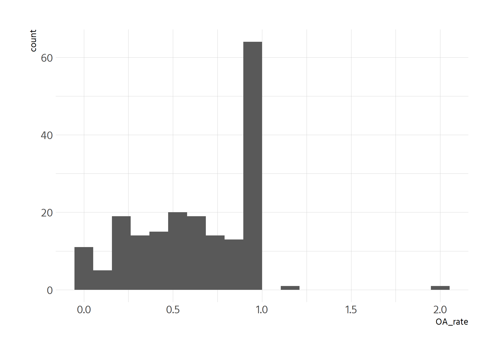
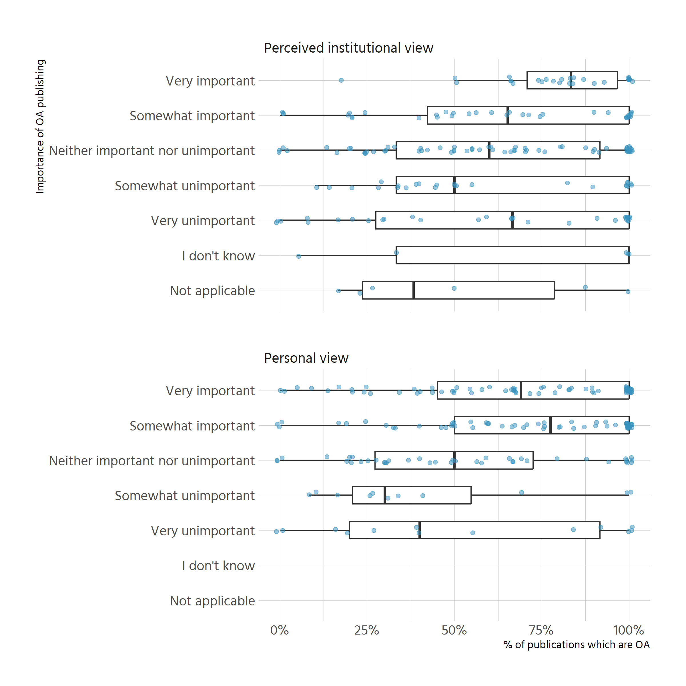
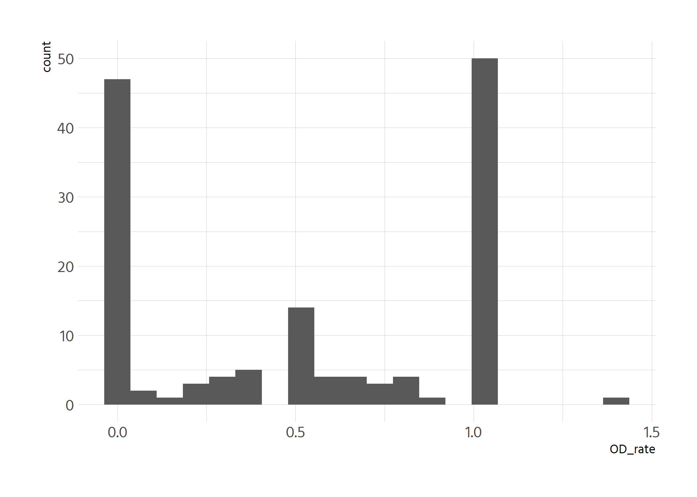
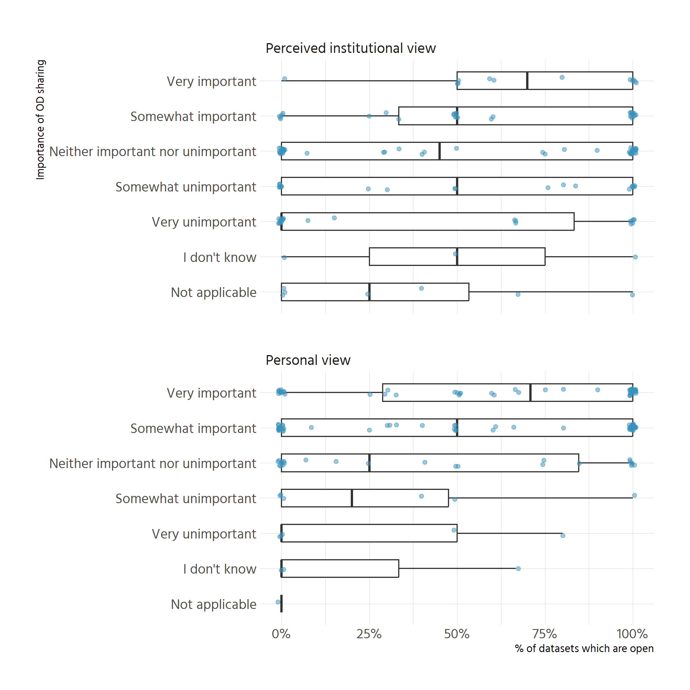
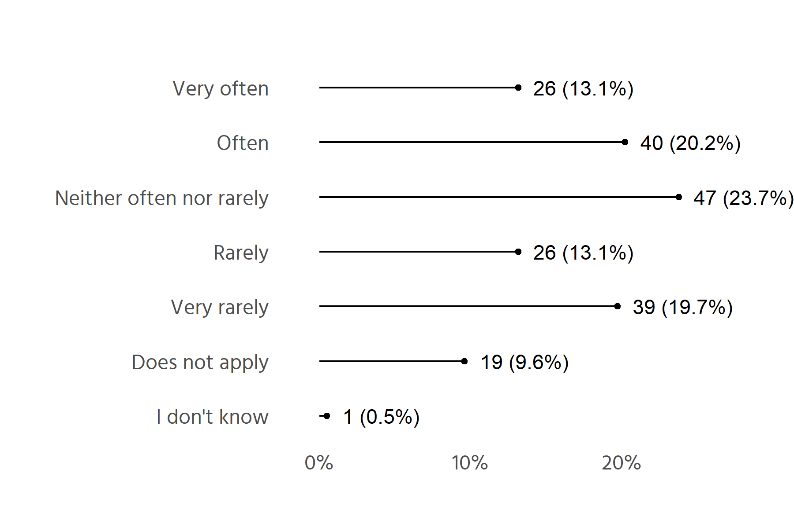
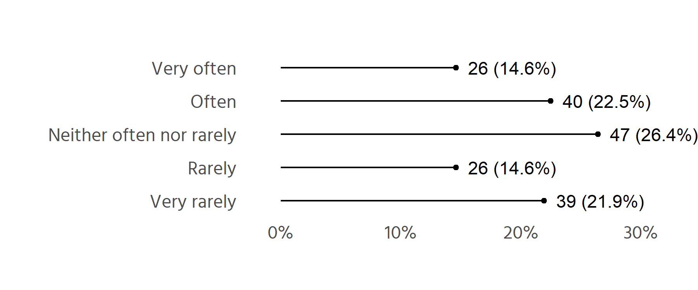

# Code sharing - who is missing?
Characterise respondents that answer "Not applicable" to code sharing.


```r
# X53 is personal view on code sharing
df %>% 
  mutate(X53 = factor(X53, levels = opinion_levels)) %>% 
  tabyl(disciplines_recoded_wos, X53) %>% 
  custom_adorns() %>% 
  knitr::kable()
```

```
## mutate: converted 'X53' from character to factor (0 new NA)
```


|disciplines_recoded_wos     |Very important |Somewhat important |Neither important nor unimportant |Somewhat unimportant |Very unimportant |I don't know |Not applicable |Total        |
|:---------------------------|:--------------|:------------------|:---------------------------------|:--------------------|:----------------|:------------|:--------------|:------------|
|Arts & Humanities           |14.3%  (1)     |28.6%  (2)         |0.0%  (0)                         |14.3% (1)            |14.3% (1)        |14.3% (1)    |14.3%  (1)     |100.0%   (7) |
|Life Sciences & Biomedicine |29.5% (26)     |33.0% (29)         |17.0% (15)                        |4.5% (4)             |4.5% (4)         |3.4% (3)     |8.0%  (7)      |100.0%  (88) |
|Physical Sciences           |25.9%  (7)     |33.3%  (9)         |25.9%  (7)                        |3.7% (1)             |7.4% (2)         |0.0% (0)     |3.7%  (1)      |100.0%  (27) |
|Social Sciences             |22.2%  (8)     |25.0%  (9)         |25.0%  (9)                        |5.6% (2)             |5.6% (2)         |2.8% (1)     |13.9%  (5)     |100.0%  (36) |
|Technology                  |30.8% (12)     |33.3% (13)         |25.6% (10)                        |0.0% (0)             |0.0% (0)         |2.6% (1)     |7.7%  (3)      |100.0%  (39) |
|NA                          |0.0%  (0)      |0.0%  (0)          |0.0%  (0)                         |0.0% (0)             |0.0% (0)         |0.0% (0)     |100.0%  (1)    |100.0%   (1) |
|Total                       |27.3% (54)     |31.3% (62)         |20.7% (41)                        |4.0% (8)             |4.5% (9)         |3.0% (6)     |9.1% (18)      |100.0% (198) |

The answers "I don't know" and "Not applicable" are clearly over-represented 
among SSH in the
question on the personal relevance of code sharing.


# Relevance of impact beyond academia vs institutional view

# Open practice vs opinion
## OA publishing

```r
# OA publishing
# X68 = pubs total
# X69 = pubs OA
# X51 = personal opinion on OA
# X27 = institutional opinion on OA

oa_practice <- df %>% 
  select(X27, X51, X68, X69) %>% 
  mutate(OA_rate = X69/X68,
         X51 = factor(X51, levels = opinion_levels),
         X27 = factor(X27, levels = opinion_levels))
```

```
## select: dropped 69 variables (X1, X3, X7, X8, X9, …)
```

```
## mutate: converted 'X27' from character to factor (0 new NA)
```

```
##         converted 'X51' from character to factor (0 new NA)
```

```
##         new variable 'OA_rate' (double) with 57 unique values and 1% NA
```

```r
oa_practice
```

```
## # A tibble: 198 × 5
##    X27                               X51                       X68   X69 OA_rate
##    <fct>                             <fct>                   <dbl> <dbl>   <dbl>
##  1 Neither important nor unimportant Neither important nor …    15     6   0.4  
##  2 Neither important nor unimportant Very important             75    30   0.4  
##  3 I don't know                      Very important             60     3   0.05 
##  4 Neither important nor unimportant Very unimportant           12    11   0.917
##  5 Neither important nor unimportant Neither important nor …    10     7   0.7  
##  6 Very important                    Very important             33    25   0.758
##  7 Neither important nor unimportant Very important              3     2   0.667
##  8 Neither important nor unimportant Somewhat important         10     6   0.6  
##  9 Neither important nor unimportant Somewhat important         55    35   0.636
## 10 Somewhat important                Very important              4     4   1    
## # … with 188 more rows
```


```r
ggplot(oa_practice, aes(OA_rate)) +
  geom_histogram(bins = 20)
```

<!-- -->
Values that should not exist, i.e. more OA articles than total articles.
-> Removing those two cases


```r
oa_practice <- oa_practice %>% 
  filter(OA_rate <= 1 | is.na(OA_rate))
```

```
## filter: removed 2 rows (1%), 196 rows remaining
```


```r
set.seed(123)
oa_practice %>% 
  pivot_longer(c(X27, X51), names_to = "variable") %>% 
  mutate(variable_rec = recode(variable, X27 = "Perceived institutional view",
                               X51 = "Personal view")) %>% 
  ggplot(aes(OA_rate, fct_rev(value))) +
  geom_boxplot(width = .5, outlier.alpha = 0) +
  geom_jitter(height = .1, width = .01, colour = custom_blue, alpha = .5) +
  facet_wrap(vars(variable_rec), nrow = 2) +
  scale_x_continuous(labels = scales::percent) +
  labs(x = "% of publications which are OA", y = "Importance of OA publishing")
```

```
## pivot_longer: reorganized (X27, X51) into (variable, value) [was 196x5, now 392x5]
```

```
## mutate: new variable 'variable_rec' (character) with 2 unique values and 0% NA
```

<!-- -->
General trend holds: if respondents think OA is more important, they also have 
more OA publications, and vice versa. 

More strict tests for personal view:

```r
m1 <- aov(OA_rate ~ X51, data = oa_practice)
```

```r
summary(m1)
```

```
##              Df Sum Sq Mean Sq F value  Pr(>F)   
## X51           4  1.723  0.4307    4.39 0.00204 **
## Residuals   189 18.542  0.0981                   
## ---
## Signif. codes:  0 '***' 0.001 '**' 0.01 '*' 0.05 '.' 0.1 ' ' 1
## 2 observations deleted due to missingness
```


```r
pairwise.t.test(oa_practice$OA_rate, oa_practice$X51, p.adjust.method = "BH")
```

```
## 
## 	Pairwise comparisons using t tests with pooled SD 
## 
## data:  oa_practice$OA_rate and oa_practice$X51 
## 
##                                   Very important Somewhat important
## Somewhat important                0.491          -                 
## Neither important nor unimportant 0.042          0.020             
## Somewhat unimportant              0.042          0.020             
## Very unimportant                  0.179          0.076             
##                                   Neither important nor unimportant
## Somewhat important                -                                
## Neither important nor unimportant -                                
## Somewhat unimportant              0.485                            
## Very unimportant                  0.975                            
##                                   Somewhat unimportant
## Somewhat important                -                   
## Neither important nor unimportant -                   
## Somewhat unimportant              -                   
## Very unimportant                  0.491               
## 
## P value adjustment method: BH
```

Some group differences are "statistically significant". But this also comes down
to the method used for the correction. Overall, it seems reasonable to state 
that higher OA share is related to stronger opinion in favour.


```r
# effect size
eta <- DescTools::EtaSq(m1)[1]
eta
```

```
## [1] 0.08501282
```

Not versed with these values, would need to look into how specifically interpret.

## Open data

```r
# Data sharing
# X72 = pubs total
# X73 = pubs OA
# X52 = personal opinion on OD
# X28 = institutional opinion on OD

od_practice <- df %>% 
  select(X28, X52, X72, X73) %>% 
  mutate(OD_rate = X73/X72,
         X52 = factor(X52, levels = opinion_levels),
         X28 = factor(X28, levels = opinion_levels))
```

```
## select: dropped 69 variables (X1, X3, X7, X8, X9, …)
```

```
## mutate: converted 'X28' from character to factor (0 new NA)
```

```
##         converted 'X52' from character to factor (0 new NA)
```

```
##         new variable 'OD_rate' (double) with 19 unique values and 28% NA
```

```r
od_practice
```

```
## # A tibble: 198 × 5
##    X28                               X52                       X72   X73 OD_rate
##    <fct>                             <fct>                   <dbl> <dbl>   <dbl>
##  1 Neither important nor unimportant Neither important nor …     0    NA    NA  
##  2 Neither important nor unimportant Very important             20    18     0.9
##  3 Neither important nor unimportant Very important             10    10     1  
##  4 Neither important nor unimportant Very important              2     2     1  
##  5 Neither important nor unimportant Somewhat important          3     0     0  
##  6 Very important                    Very important              0    NA    NA  
##  7 Neither important nor unimportant Very important              3     0     0  
##  8 Neither important nor unimportant Somewhat important        100     0     0  
##  9 Neither important nor unimportant Somewhat important          1     0     0  
## 10 Very important                    Very important              1     1     1  
## # … with 188 more rows
```


```r
ggplot(od_practice, aes(OD_rate)) +
  geom_histogram(bins = 20)
```

<!-- -->
Values that should not exist, i.e. more open datasets than total datasets
-> Removing this case.


```r
od_practice <- od_practice %>% 
  filter(OD_rate <= 1 | is.na(OD_rate)) %>% 
  filter(!is.na(OD_rate))
```

```
## filter: removed one row (1%), 197 rows remaining
```

```
## filter: removed 55 rows (28%), 142 rows remaining
```


```r
set.seed(123)
od_practice %>% 
  pivot_longer(c(X28, X52), names_to = "variable") %>% 
  mutate(variable_rec = recode(variable, X28 = "Perceived institutional view",
                               X52 = "Personal view")) %>% 
  ggplot(aes(OD_rate, fct_rev(value))) +
  geom_boxplot(width = .5, outlier.alpha = 0) +
  geom_jitter(height = .1, width = .01, colour = custom_blue, alpha = .5) +
  facet_wrap(vars(variable_rec), nrow = 2) +
  scale_x_continuous(labels = scales::percent) +
  labs(x = "% of datasets which are open", y = "Importance of OD sharing")
```

```
## pivot_longer: reorganized (X28, X52) into (variable, value) [was 142x5, now 284x5]
```

```
## mutate: new variable 'variable_rec' (character) with 2 unique values and 0% NA
```

<!-- -->


```r
m2 <- aov(OD_rate ~ X28  + X52, data = od_practice)
summary(m2)
```

```
##              Df Sum Sq Mean Sq F value Pr(>F)
## X28           6  1.501  0.2501   1.368  0.232
## X52           6  0.953  0.1589   0.869  0.520
## Residuals   129 23.582  0.1828
```
Differences are not statistically significant. However, this model is likely not
suitable to the data at hand (zero and one inflation, general structure of 
response in interval [0, 1], etc.)

A better alternative is to look at chisquare tables. The following table is
for the institutional view.

```r
inst_table <- od_practice %>% 
  filter(!(X28 %in% c("Not applicable", "I don't know"))) %>% 
  mutate(X28 = fct_drop(X28)) %>% 
  mutate(od_cats = cut_interval(OD_rate, 4) %>% fct_rev()) %>% 
  tabyl(od_cats, X28)
```

```
## filter: removed 10 rows (7%), 132 rows remaining
```

```
## mutate: changed 0 values (0%) of 'X28' (0 new NA)
```

```
## mutate: new variable 'od_cats' (factor) with 4 unique values and 0% NA
```

```r
chisq.test(inst_table)  
```

```
## 
## 	Pearson's Chi-squared test
## 
## data:  inst_table
## X-squared = 22.109, df = 12, p-value = 0.03632
```

```r
inst_table %>% 
  custom_adorns() %>% 
  knitr::kable()
```


|od_cats    |Very important |Somewhat important |Neither important nor unimportant |Somewhat unimportant |Very unimportant |Total        |
|:----------|:--------------|:------------------|:---------------------------------|:--------------------|:----------------|:------------|
|(0.75,1]   |11.3%  (6)     |22.6% (12)         |39.6% (21)                        |15.1%  (8)           |11.3%  (6)       |100.0%  (53) |
|(0.5,0.75] |20.0%  (2)     |20.0%  (2)         |20.0%  (2)                        |10.0%  (1)           |30.0%  (3)       |100.0%  (10) |
|(0.25,0.5] |14.3%  (3)     |42.9%  (9)         |28.6%  (6)                        |14.3%  (3)           |0.0%  (0)        |100.0%  (21) |
|[0,0.25]   |2.1%  (1)      |12.5%  (6)         |39.6% (19)                        |16.7%  (8)           |29.2% (14)       |100.0%  (48) |
|Total      |9.1% (12)      |22.0% (29)         |36.4% (48)                        |15.2% (20)           |17.4% (23)       |100.0% (132) |


```r
personal_table <- od_practice %>% 
  filter(!(X52 %in% c("Not applicable", "I don't know"))) %>% 
  mutate(X52 = fct_drop(X52)) %>% 
  mutate(od_cats = cut_interval(OD_rate, 4) %>% fct_rev()) %>% 
  tabyl(od_cats, X52)
```

```
## filter: removed 4 rows (3%), 138 rows remaining
```

```
## mutate: changed 0 values (0%) of 'X52' (0 new NA)
```

```
## mutate: new variable 'od_cats' (factor) with 4 unique values and 0% NA
```

```r
chisq.test(personal_table)  
```

```
## 
## 	Pearson's Chi-squared test
## 
## data:  personal_table
## X-squared = 10.622, df = 12, p-value = 0.5616
```

```r
personal_table %>% 
  custom_adorns() %>% 
  knitr::kable()
```


|od_cats    |Very important |Somewhat important |Neither important nor unimportant |Somewhat unimportant |Very unimportant |Total        |
|:----------|:--------------|:------------------|:---------------------------------|:--------------------|:----------------|:------------|
|(0.75,1]   |41.8% (23)     |41.8% (23)         |12.7%  (7)                        |1.8% (1)             |1.8% (1)         |100.0%  (55) |
|(0.5,0.75] |50.0%  (5)     |30.0%  (3)         |20.0%  (2)                        |0.0% (0)             |0.0% (0)         |100.0%  (10) |
|(0.25,0.5] |34.8%  (8)     |39.1%  (9)         |13.0%  (3)                        |8.7% (2)             |4.3% (1)         |100.0%  (23) |
|[0,0.25]   |24.0% (12)     |38.0% (19)         |26.0% (13)                        |6.0% (3)             |6.0% (3)         |100.0%  (50) |
|Total      |34.8% (48)     |39.1% (54)         |18.1% (25)                        |4.3% (6)             |3.6% (5)         |100.0% (138) |

Based on these tables:

- There seems to be no association between personal views on OD as a promotion
criterion and actual OD practice.
- There seems to be some association between perceived institutional view on OD
as a promotion criterion and actual OD practice. 
- This is contrary to the conclusions that one might glimpse from comparing 
medians. Why?

# Influence of policies on choice of venue
Question: In the last three years, my choice of publication venue (journal, book publisher, conference, etc.) was influenced by the promotion criteria of my university.

With "other" values

```r
df %>% 
  select(X71) %>% 
  mutate(X71 = fct_relevel(X71,
                           "Very often", "Often", "Neither often nor rarely",
                           "Rarely", "Very rarely") %>% fct_rev()) %>% 
  plot_bar(X71, reorder = FALSE, nudge_y = .01)
```

```
## select: dropped 72 variables (X1, X3, X7, X8, X9, …)
```

```
## mutate: converted 'X71' from character to factor (0 new NA)
```

```
## count: now 7 rows and 2 columns, ungrouped
```

```
## drop_na: no rows removed
```

```
## mutate: new variable 'prop' (double) with 6 unique values and 0% NA
```

```
##         new variable 'label' (character) with 6 unique values and 0% NA
```

```
##         new variable 'xvar' (factor) with 7 unique values and 0% NA
```

```
## filter: no rows removed
```

```
## Registered S3 methods overwritten by 'ggalt':
##   method                  from   
##   grid.draw.absoluteGrob  ggplot2
##   grobHeight.absoluteGrob ggplot2
##   grobWidth.absoluteGrob  ggplot2
##   grobX.absoluteGrob      ggplot2
##   grobY.absoluteGrob      ggplot2
```

<!-- -->

Without

```r
df %>% 
  select(X71) %>% 
  filter(!(X71 %in% c("I don't know", "Does not apply"))) %>% 
  mutate(X71 = fct_relevel(X71,
                           "Very often", "Often", "Neither often nor rarely",
                           "Rarely", "Very rarely") %>% fct_rev()) %>% 
  plot_bar(X71, reorder = FALSE, nudge_y = .01)
```

```
## select: dropped 72 variables (X1, X3, X7, X8, X9, …)
```

```
## filter: removed 20 rows (10%), 178 rows remaining
```

```
## mutate: converted 'X71' from character to factor (0 new NA)
```

```
## count: now 5 rows and 2 columns, ungrouped
```

```
## drop_na: no rows removed
```

```
## mutate: new variable 'prop' (double) with 4 unique values and 0% NA
```

```
##         new variable 'label' (character) with 4 unique values and 0% NA
```

```
##         new variable 'xvar' (factor) with 5 unique values and 0% NA
```

```
## filter: no rows removed
```

<!-- -->
This version has 178 cases.
