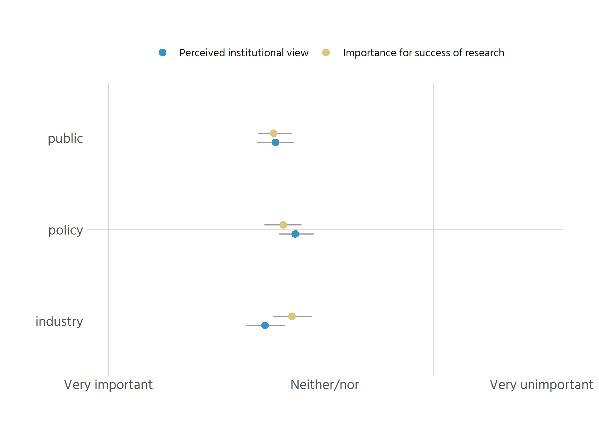
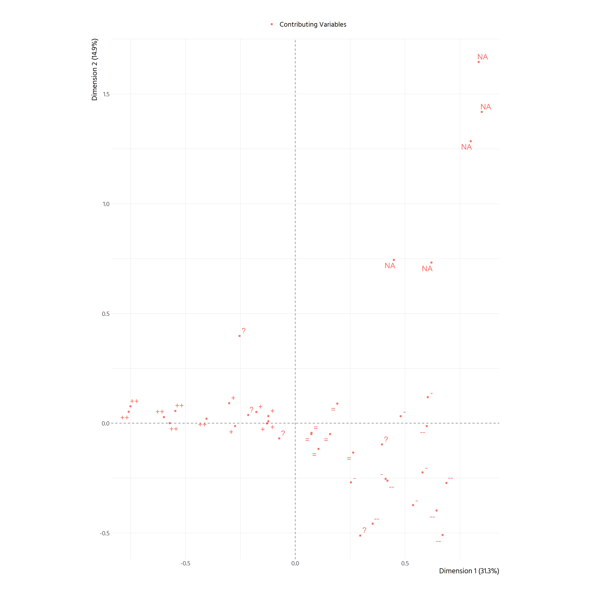
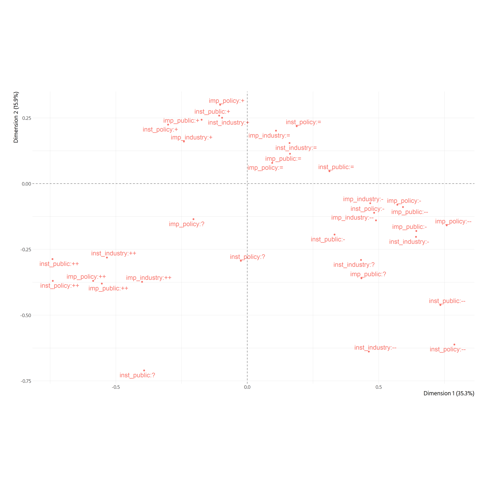
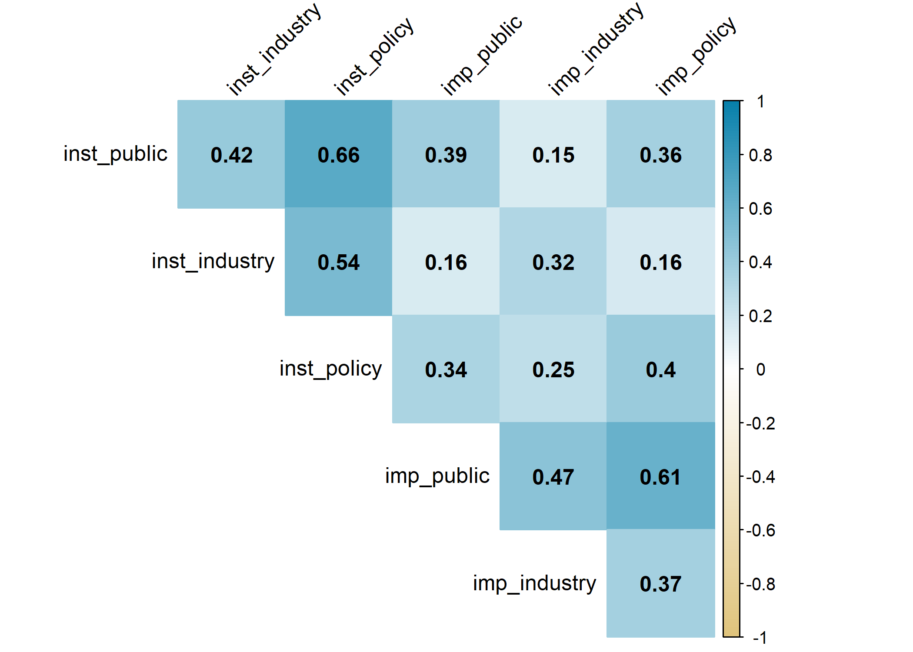

Do two approaches:

1. Similar to the general comparison plot, comparing aggregate levels
2. Correspondence analysis


```r
# How important to engage with
# X78 = public
# X80 = industry
# X82 = Policy

# Institutional policy
# X30  = public
# X31  = industry
# X33 = policy

core_data <- df %>% 
  select(inst_public = X30, inst_industry = X31, inst_policy = X33,
         imp_public = X78, imp_industry = X80, imp_policy = X82)
```

```
## select: renamed 6 variables (inst_public, inst_industry, inst_policy, imp_public, imp_industry, …) and dropped 67 variables
```

```r
core_data %>% 
  head(10) %>% 
  knitr::kable()
```


|inst_public                       |inst_industry                     |inst_policy                       |imp_public                        |imp_industry                      |imp_policy                        |
|:---------------------------------|:---------------------------------|:---------------------------------|:---------------------------------|:---------------------------------|:---------------------------------|
|Neither important nor unimportant |Somewhat important                |Neither important nor unimportant |Unimportant                       |Neither important nor unimportant |Unimportant                       |
|Somewhat important                |Somewhat important                |Somewhat unimportant              |Very important                    |Unimportant                       |Important                         |
|Neither important nor unimportant |Somewhat important                |Somewhat important                |Neither important nor unimportant |Neither important nor unimportant |Neither important nor unimportant |
|Somewhat important                |Very important                    |Neither important nor unimportant |Important                         |Important                         |Very important                    |
|Somewhat important                |Somewhat important                |Somewhat important                |Important                         |Neither important nor unimportant |Neither important nor unimportant |
|Very important                    |Very important                    |Very important                    |Neither important nor unimportant |Important                         |Important                         |
|Neither important nor unimportant |Very important                    |I don't know                      |Very important                    |Very important                    |Neither important nor unimportant |
|Neither important nor unimportant |Somewhat important                |Neither important nor unimportant |Neither important nor unimportant |Neither important nor unimportant |Very unimportant                  |
|Somewhat important                |Somewhat important                |Somewhat important                |Neither important nor unimportant |Neither important nor unimportant |Neither important nor unimportant |
|Somewhat important                |Neither important nor unimportant |Very important                    |Important                         |Neither important nor unimportant |Very important                    |


```r
long_data <- core_data %>% 
  mutate(across(.fns = get_numeric_val)) %>% 
  pivot_longer(everything(), names_to = c("source", "type"),
               names_pattern = "(.*)_(.*)") %>% 
  mutate(source = recode(source, inst = "Perceived institutional view", 
                         imp = "Importance for success of research"))
```

```
## mutate: converted 'inst_public' from character to integer (10 new NA)
```

```
##         converted 'inst_industry' from character to integer (16 new NA)
```

```
##         converted 'inst_policy' from character to integer (20 new NA)
```

```
##         converted 'imp_public' from character to integer (4 new NA)
```

```
##         converted 'imp_industry' from character to integer (10 new NA)
```

```
##         converted 'imp_policy' from character to integer (14 new NA)
```

```
## pivot_longer: reorganized (inst_public, inst_industry, inst_policy, imp_public, imp_industry, …) into (source, type, value) [was 198x6, now 1188x3]
```

```
## mutate: changed 1,188 values (100%) of 'source' (0 new NA)
```


```r
bootstrapped <- long_data %>% 
  group_by(source, type) %>% 
  summarise(res = list(Hmisc::smean.cl.boot(value))) %>%
  unnest_wider(res)
```

```
## group_by: 2 grouping variables (source, type)
```

```
## summarise: now 6 rows and 3 columns, one group variable remaining (source)
```

```r
dodge_width <- .2
yellow <- "#E0C47C"

bootstrapped %>% 
  ggplot(aes(Mean, type, colour = source)) +
  geom_linerange(aes(xmin = Lower, xmax = Upper, group = fct_rev(source)),
                 position = position_dodge(width = dodge_width),
                 colour = "grey60") +
  geom_point(aes(colour = fct_rev(source)), size = 2.6,
             position = position_dodge(width = dodge_width)) +
  five_point_scale() +
    scale_colour_manual(values = c(
    `Importance for success of research` =  yellow, #"#B96FB0",
    `Perceived institutional view` = custom_blue #"#54984E"
  )) +
  labs(y = NULL, colour = NULL, x = NULL) +
  theme(legend.position = "top")
```

<!-- -->

Aggregate levels are very similar. Biggest dis-alignment with industry, although
differences still quite close and within confidence intervals for the means.

## Via correspondence analysis

```r
# simplify for plotting
make_names_simple <- function(x, keep_NA = TRUE) {
  if (keep_NA) {
    case_when(
      x == "Very important" ~ "++",
      x == "Important" ~ "+",
      x == "Somewhat important" ~ "+",
      x == "Neither important nor unimportant" ~ "=",
      x == "Unimportant" ~ "-",
      x == "Somewhat unimportant" ~ "-",
      x == "Very unimportant" ~ "--",
      x == "I don't know" ~ "?",
      x == "Not applicable" ~ "NA"
    )
  } else {
    case_when(
      x == "Very important" ~ "++",
      x == "Important" ~ "+",
      x == "Somewhat important" ~ "+",
      x == "Neither important nor unimportant" ~ "=",
      x == "Unimportant" ~ "-",
      x == "Somewhat unimportant" ~ "-",
      x == "Very unimportant" ~ "--",
      x == "I don't know" ~ "?"
    )
  }

}
```


```r
mca_model <- core_data %>%
  mutate(across(everything(), make_names_simple)) %>% 
  ca::mjca()
```

```
## mutate: changed 198 values (100%) of 'inst_public' (0 new NA)
```

```
##         changed 198 values (100%) of 'inst_industry' (0 new NA)
```

```
##         changed 198 values (100%) of 'inst_policy' (0 new NA)
```

```
##         changed 198 values (100%) of 'imp_public' (0 new NA)
```

```
##         changed 198 values (100%) of 'imp_industry' (0 new NA)
```

```
##         changed 198 values (100%) of 'imp_policy' (0 new NA)
```


```r
prettify <- list(
  theme(legend.position = "top",
        axis.title.x = element_text(size = rel(1.5)),
        axis.title.y = element_text(size = rel(1.5)),
        axis.text = element_text(size = rel(1.2)),
        legend.text = element_text(size = rel(1.1)))
  #scale_color_manual(values = scale_spectral) 
)
```


```r
# scale_short <- c("Indicator present" = "#3588BD", 
#                     "Indicator not present" = "#C26574")

mca_model %>%
  plot_ca(font_size = 5, show.legend = TRUE) +
  coord_fixed() +
  prettify 
```

```
## mutate: changed 40 values (100%) of 'rowname' (0 new NA)
```

```
##         new variable 'Profil' (character) with one unique value and 0% NA
```

```
## slice: removed all rows (100%)
```

```
## mutate: new variable 'sup_var' (factor) with 0 unique values and 100% NA
```

```
## full_join: added 3 columns (x, y, Profil)
```

```
##            > rows only in x    0
```

```
##            > rows only in y   40
```

```
##            > matched rows      0
```

```
##            >                 ====
```

```
##            > rows total       40
```

```
## replace_na: changed 40 values (100%) of 'sup_var' (40 fewer NA)
```

<!-- -->

Second dimension is mainly NAs, so removing.


```r
m2 <- core_data %>%
  mutate(across(everything(), make_names_simple, keep_NA = FALSE)) %>% 
  ca::mjca()
```

```
## mutate: changed 198 values (100%) of 'inst_public' (7 new NA)
```

```
##         changed 198 values (100%) of 'inst_industry' (12 new NA)
```

```
##         changed 198 values (100%) of 'inst_policy' (8 new NA)
```

```
##         changed 198 values (100%) of 'imp_public' (0 new NA)
```

```
##         changed 198 values (100%) of 'imp_industry' (10 new NA)
```

```
##         changed 198 values (100%) of 'imp_policy' (4 new NA)
```


```r
m2 %>%
  plot_ca(font_size = 5, keep_labels = TRUE) +
  coord_fixed() +
  prettify 
```

```
## mutate: new variable 'Profil' (character) with one unique value and 0% NA
```

```
## slice: removed all rows (100%)
```

```
## mutate: new variable 'sup_var' (factor) with 0 unique values and 100% NA
```

```
## full_join: added 3 columns (x, y, Profil)
```

```
##            > rows only in x    0
```

```
##            > rows only in y   35
```

```
##            > matched rows      0
```

```
##            >                 ====
```

```
##            > rows total       35
```

```
## replace_na: changed 35 values (100%) of 'sup_var' (35 fewer NA)
```

<!-- -->

Broadly speaking: categories agree to each other, all of them are similar.
Only exception: perceived institutional policies of complete unimportance are a 
little removed from the rest - level of unimportance is higher for these three
than for the importance to own research.

The general pattern is a typical horseshoe-patter and of no substantive 
relevance.

A correlation analysis likely might bring out more subtle differences.


## Correlation analysis

```r
cor_base <- core_data %>% 
  mutate(across(.fns = get_numeric_val))
```

```
## mutate: converted 'inst_public' from character to integer (10 new NA)
```

```
##         converted 'inst_industry' from character to integer (16 new NA)
```

```
##         converted 'inst_policy' from character to integer (20 new NA)
```

```
##         converted 'imp_public' from character to integer (4 new NA)
```

```
##         converted 'imp_industry' from character to integer (10 new NA)
```

```
##         converted 'imp_policy' from character to integer (14 new NA)
```

```r
cor_matrix <- cor_base %>% 
  cor(use = "pairwise.complete.obs", method = "spearman")
cor_matrix %>% 
  knitr::kable()
```


|              | inst_public| inst_industry| inst_policy| imp_public| imp_industry| imp_policy|
|:-------------|-----------:|-------------:|-----------:|----------:|------------:|----------:|
|inst_public   |   1.0000000|     0.4172419|   0.6633837|  0.3878459|    0.1526236|  0.3612194|
|inst_industry |   0.4172419|     1.0000000|   0.5394400|  0.1588892|    0.3176614|  0.1602090|
|inst_policy   |   0.6633837|     0.5394400|   1.0000000|  0.3375562|    0.2536682|  0.4028998|
|imp_public    |   0.3878459|     0.1588892|   0.3375562|  1.0000000|    0.4674405|  0.6088790|
|imp_industry  |   0.1526236|     0.3176614|   0.2536682|  0.4674405|    1.0000000|  0.3689097|
|imp_policy    |   0.3612194|     0.1602090|   0.4028998|  0.6088790|    0.3689097|  1.0000000|


```r
plot_correlation <- function(cor_matrix, cluster = TRUE) {
  # code from http://www.sthda.com/english/wiki/visualize-correlation-matrix-using-correlogram
  # col <- colorRampPalette(c("#BB4444", "#EE9988", "#FFFFFF", "#77AADD", "#4477AA"))
  
  col <- colorRampPalette(c(yellow, "#FFFFFF", "#0880AB"))
  order <- ifelse(cluster, "hclust", "original")
  
  corrplot::corrplot(
    cor_matrix, method = "color", col = col(200),  
    type = "upper", order = order, 
    addCoef.col = "black", # Add coefficient of correlation
    tl.col = "black", tl.srt = 45, #Text label color and rotation
    # hide correlation coefficient on the principal diagonal
    diag = FALSE 
  )
}
```


```r
plot_correlation(cor_matrix, cluster = FALSE)
```

<!-- -->
Here, "inst" denotes the perceived institutional policy, and "imp" denotes
the relevance to the respondents research. 

Correlations in the upper right square (3x3), which shows the relationships 
between perceived institutional policies and the relevance to research, are
generally low to moderate. 

The correlations between the three types, comparing relevance to research and
perceived institutional policy, are .39 (public), .32 (industry), and
.4 (policy). Thus, there seems to be moderate alignment between importance for
researchers and perceived institutional policies.

However, it is unclear how much alignment could be expected, and therefore,
whether this finding is of any substantive interest. 

All three key correlations are statistically significant (after correction
for multiple comparisons via the approach developed by Benhamini & Hochberg 
(1995))


```r
p_vals <- corrplot::cor.mtest(cor_base)$p
adj_p_vals <- p.adjust(p_vals, method = "fdr") %>% 
  matrix(nrow = 6) 

colnames(adj_p_vals) <- colnames(p_vals)
rownames(adj_p_vals) <- rownames(p_vals)

col <- colorRampPalette(c(yellow, "#FFFFFF", "#0880AB"))
corrplot::corrplot(
  cor_matrix, method = "color",  col = col(200),
  type = "upper", p.mat = adj_p_vals, sig.level = .05,
  addCoef.col = "black", # Add coefficient of correlation
  tl.col = "black", tl.srt = 45, #Text label color and rotation
  # hide correlation coefficient on the principal diagonal
  diag = FALSE 
)
```

<!-- -->

# Refs
Benjamini, Y., and Hochberg, Y. (1995). Controlling the false discovery rate: a practical and powerful approach to multiple testing. Journal of the Royal Statistical Society Series B, 57, 289–300. doi: 10.1111/j.2517-6161.1995.tb02031.x. https://www.jstor.org/stable/2346101.

